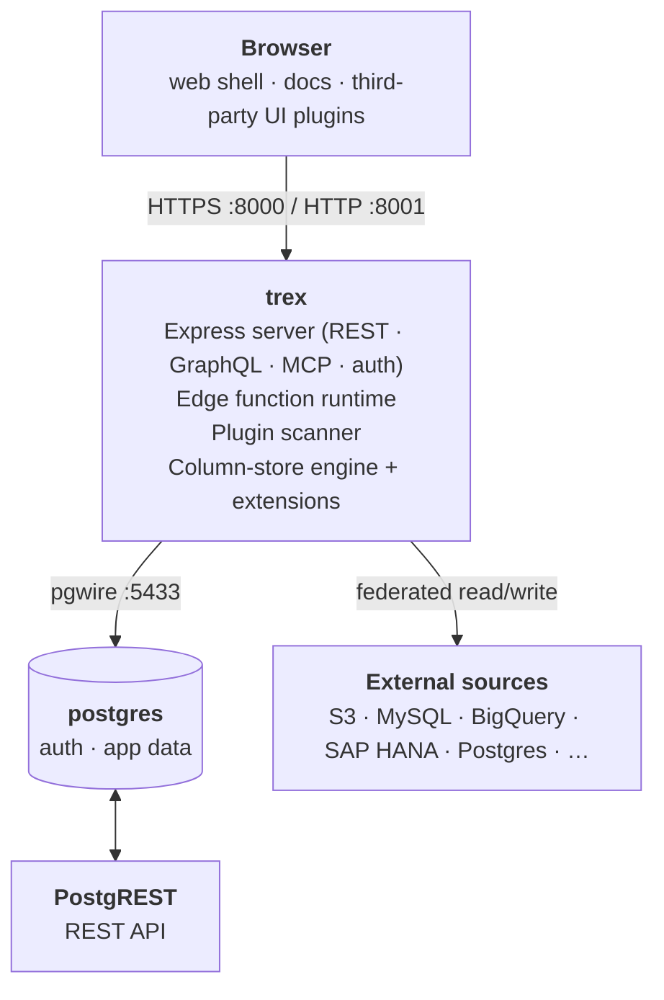

# TrexSQL

A lightweight, self-hosted backend platform built around an analytical-first database engine.

TrexSQL gives you a single binary that speaks Postgres wire, runs edge functions, hosts a plugin system for UIs and APIs, and embeds a column-store engine you can point at Parquet on S3, BigQuery, MySQL, SAP HANA, or another Postgres — all in one query. On top, an Express server provides an identity provider, a GraphQL layer over Postgres, a REST API, an admin UI, and an MCP server. The result is a small set of containers that handles application data and an analytical workload in one place.

## Quick start

```bash
git clone --recurse-submodules <repo>
cd trexsql-ext
docker compose up -d
```

UI at <http://localhost:8001/trex>.

For live source mounts during plugin development, use `docker-compose.dev.yml`.

## What you get out of the box

`docker compose up` brings up three services:

- **postgres** — vanilla Postgres 16, used for application data, the auth schema, and PostgREST's source of truth.
- **postgrest** — auto-generated REST API over Postgres.
- **trex** — the analytical core. Speaks four protocols:
  - `:8001` — HTTP for the web UI, edge functions, GraphQL, MCP server, auth
  - `:8000` — TLS-terminated HTTPS variant of the above
  - `:5433` — Postgres wire protocol (connect with `psql`, JDBC, `pg_dump`, etc.)
  - `:4200` — gossip / cluster membership for multi-node deployments

Out of the box you have:

- **Identity provider** — user signup, sign-in, magic links, password reset, email verification, role-based access, session management, an OAuth/OIDC consent flow, and machine-to-machine API keys.
- **GraphQL API** auto-generated over Postgres, served at `/trex/graphql` with a GraphiQL explorer at `/trex/graphiql`.
- **Subscriptions** — GraphQL subscriptions and live queries over Postgres `LISTEN`/`NOTIFY` push change streams to clients.
- **REST API** auto-generated over Postgres, served at `/trex/rest/v1`.
- **Edge function secrets** — encrypted secrets store with REST endpoints to list / set / unset. Secrets are loaded into edge function environments at invocation time, so functions read them as plain env vars without shipping them in code or in the image.
- **Vector search** — HNSW indexes on embedding columns inside the analytical engine, queryable in the same SQL as the rest of your data.
- **Admin UI** for managing users, databases, plugins, migrations, extensions, services, auth providers, ETL pipelines, and runtime settings.
- **UI plugin system** — loads micro-frontends at runtime via a single-spa host and registers extra nav entries from `TREX_WEB_NAV_EXTRA`.

## Analytical database

The `trex` binary embeds a column-store engine that auto-loads a curated set of extensions on startup. Out of the box you can:

- **Federate across heterogeneous sources** — query Postgres, MySQL, SQLite, BigQuery, SAP HANA, ClickHouse, S3, and HTTP-served files in a single SQL statement.
- **Read and write open table formats** — Apache Iceberg, Delta Lake, ducklake, Parquet, Avro, JSON.
- **Run search workloads** — full-text search (BM25), vector similarity (HNSW), GIS / spatial queries.
- **Speak Postgres wire** — clients connect with `psql`, JDBC, or `pg_dump` and see Trex as just another Postgres.
- **Run distributed** — multi-node cluster coordination over Arrow Flight SQL, Postgres CDC replication into Trex, schema migrations, declarative data transforms, runtime extension installation.
- **Use domain extensions** — FHIR server, OHDSI Atlas cohort-to-SQL, Clinical Quality Language to ELM, and in-process LLM inference (CUDA / Vulkan / Metal).

## Architecture



The trex container does most of the work: serves the web UI, runs edge functions, embeds the analytical engine, and exposes Postgres wire so external tools see it as just another Postgres.

## Repository layout

```
trexsql-ext/
├── core/                  Express server, auth, GraphQL, core schema
├── plugins/
│   ├── ai/                LLM inference 
│   ├── atlas/             Atlas cohort SQL
│   ├── chdb/              ClickHouse engine
│   ├── cql2elm/           CQL to ELM
│   ├── db/                Cluster coordination + Arrow Flight SQL
│   ├── etl/               Postgres CDC
│   ├── fhir/              FHIR server
│   ├── hana/              SAP HANA scanner
│   ├── migration/         Schema migrations
│   ├── pg_trex/           Postgres-with-trex packaging
│   ├── pgwire/            Postgres wire protocol
│   ├── pool/              Connection pooling
│   ├── runtime/           Trex runtime (Rust + edge function runtime, submodule)
│   ├── storage/           Object storage
│   ├── tpm/               Package manager
│   ├── transform/         Transformation pipelines
│   └── web/               Web shell
└── deploy/
    └── aws/               Pulumi config for ECS Fargate
```

## Built on

Components Trex reuses or integrates. Each fork is maintained as a submodule (or separate repo) and retains its upstream copyright and license — see the `LICENSE` file inside each submodule.

- **DuckDB** (fork, MIT) — analytical engine and C-API extension framework
- **Postgres** (PostgreSQL License) — application data, auth schema, and the wire protocol Trex speaks
- **PostgREST** (MIT) — REST API layer over Postgres
- **PostGraphile** (MIT) — GraphQL API layer over Postgres
- **Better Auth** (MIT) — identity provider, session management, OAuth/OIDC flows
- **Supabase Edge Runtime** (fork, MIT) — edge function runtime
- **Supabase Storage** (fork, Apache-2.0) — object storage plugin
- **Supabase ETL** (fork, Apache-2.0) — Postgres CDC components used by the `etl` extension
- **Supabase CLI** (fork, MIT) — local dev, migrations, function deploy, secrets management against a Trex stack

Trex is an independent project and is not affiliated with or endorsed by any of the upstream projects listed here.

## Building from source

Most extensions follow the same Makefile pattern:

```bash
make configure      # one-time setup (Python venv, platform detection)
make debug          # debug build
make release        # release build
make test_debug     # run tests
make clean          # remove build/
make clean_all      # remove build/ and configure/
```

To rebuild the trex container locally:

```bash
docker compose -f docker-compose.dev.yml build trex
```

For full development setup, see `CLAUDE.md`.

## License

Apache-2.0.
