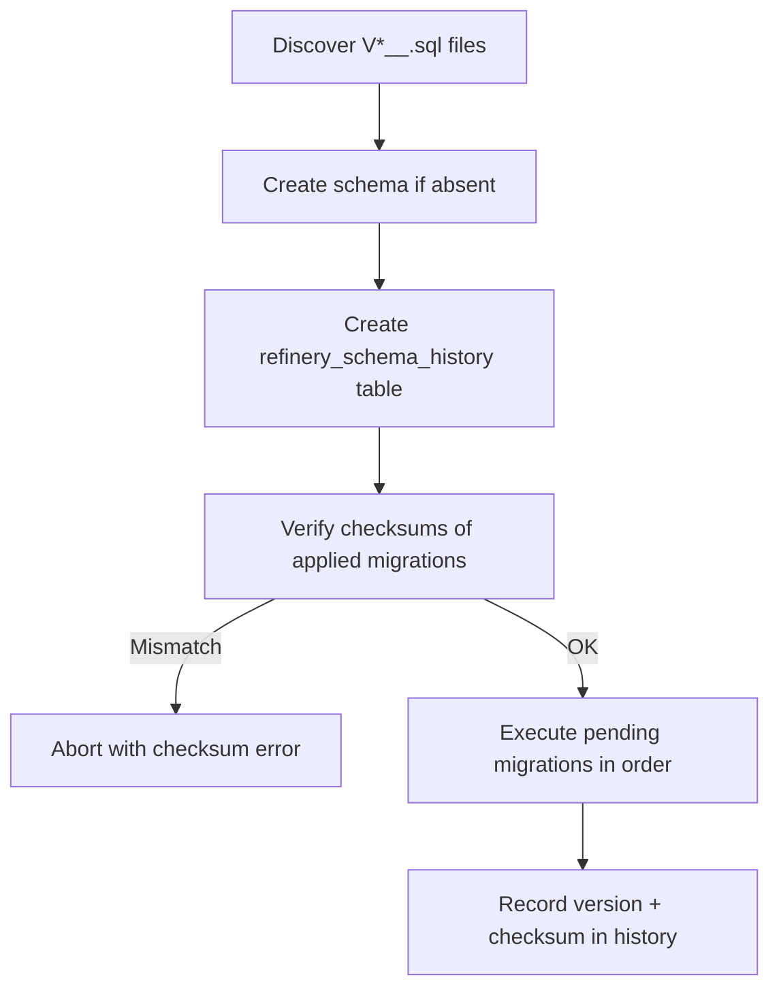

# Migration Plugins

Migration plugins manage SQL schema migrations for plugin-specific databases. Migrations are versioned SQL files that are automatically executed at server startup, with checksum verification to prevent tampering.

## Configuration

```json
{
  "trex": {
    "migrations": {
      "schema": "my_plugin",
      "database": "_config"
    }
  }
}
```

| Field | Type | Default | Description |
|-------|------|---------|-------------|
| `schema` | string | *(required)* | Target schema name. Created automatically if it does not exist |
| `database` | string | `_config` | Target database. Use `_config` for PostgreSQL, or a trexsql database name |

Migration files are read from a `migrations/` directory inside the plugin package.

## File Naming Convention

Migration files must follow the pattern `V<version>__<name>.sql`:

```
migrations/
├── V1__create_tables.sql
├── V2__add_indexes.sql
└── V3__seed_data.sql
```

**Rules:**
- **V prefix** — files must start with an uppercase `V`
- **Version** — positive integer immediately after `V`
- **Separator** — double underscore `__` between version and name
- **Name** — alphanumeric characters and underscores only
- **Extension** — must end with `.sql`
- **Unique versions** — duplicate version numbers cause an error

Files that don't match this pattern are silently skipped.

## Execution Lifecycle



## History Table

Each schema gets a `refinery_schema_history` table that tracks applied migrations:

| Column | Type | Description |
|--------|------|-------------|
| `version` | INT4 (PK) | Migration version number |
| `name` | VARCHAR | Migration name (from filename) |
| `applied_on` | VARCHAR | Timestamp when the migration was applied |
| `checksum` | VARCHAR | SipHash-1-3 checksum for integrity verification |

## Checksum Verification

Every migration file gets a checksum computed from its name, version number, and SQL content using SipHash-1-3. When the migration runner starts, it compares stored checksums against current file checksums. A mismatch means a previously applied migration was modified, which aborts execution to prevent schema drift.

## Multi-Database Support

The `database` field controls where migrations run:

| Value | Target |
|-------|--------|
| `_config` | PostgreSQL metadata database (via the configured `DATABASE_URL`) |
| `memory` | trexsql in-memory database |
| *other* | A named trexsql attached database |

## Automatic Execution

All registered migration plugins run automatically at server startup via `runAllPluginMigrations()`. This happens after plugin discovery but before the server begins accepting requests.

Migrations can also be triggered manually via GraphQL:

```graphql
# Run migrations for a specific plugin
mutation {
  runPluginMigrations(pluginName: "my-plugin") {
    success
    error
    results {
      version
      name
      status
    }
  }
}

# Run all pending migrations
mutation {
  runPluginMigrations {
    success
    error
  }
}
```

## Monitoring

Query migration status across all plugins:

```graphql
query {
  trexMigrations {
    pluginName
    schema
    database
    currentVersion
    totalMigrations
    appliedCount
    pendingCount
    migrations {
      version
      name
      status
      appliedOn
      checksum
    }
  }
}
```

## Error Handling

| Error | Cause | Resolution |
|-------|-------|------------|
| Missing schema | `schema` field not set in config | Add a `schema` string to `trex.migrations` |
| Duplicate version | Two files share the same version number | Renumber one of the conflicting files |
| Checksum mismatch | An applied migration file was modified | Restore the original file content or reset the history |
| SQL failure | A migration statement failed | Fix the SQL and re-run |
| Directory not found | `migrations/` directory missing from plugin | Create the directory and add migration files |

## Complete Example

```json
{
  "name": "@trex/my-plugin",
  "version": "1.0.0",
  "trex": {
    "migrations": {
      "schema": "my_plugin",
      "database": "_config"
    }
  }
}
```

```
my-plugin/
├── package.json
└── migrations/
    ├── V1__create_tables.sql
    ├── V2__add_indexes.sql
    └── V3__add_audit_columns.sql
```
