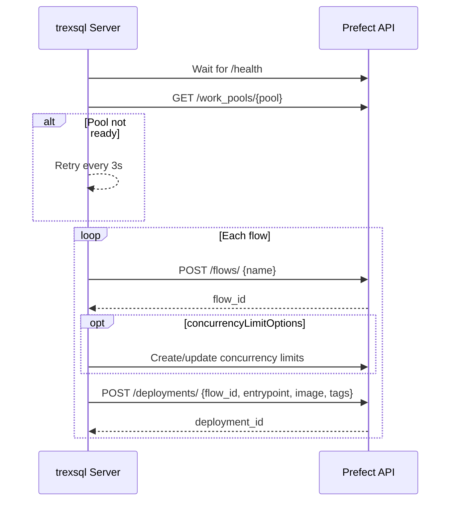

# Flow Plugins

Flow plugins deploy workflow definitions to a [Prefect](https://www.prefect.io/) server. Each flow is registered as a Prefect deployment with Docker-based execution, concurrency limits, and tagging.

## Prerequisites

- A running Prefect server (set `PREFECT_API_URL`)
- A configured worker pool (default: `default`)
- Docker images containing your flow code

## Configuration

```json
{
  "trex": {
    "flow": {
      "image": "my-registry.io/my-flows",
      "flows": [
        {
          "name": "etl-daily",
          "entrypoint": "flows/etl.py:daily_sync",
          "image": "my-registry.io/my-etl",
          "tags": ["etl", "daily"],
          "concurrencyLimitOptions": [
            { "tag": "etl-limit", "limit": "ETL_CONCURRENCY" }
          ]
        }
      ]
    }
  }
}
```

## Flow Definition

| Field | Type | Description |
|-------|------|-------------|
| `name` | string | Flow and deployment name in Prefect |
| `entrypoint` | string | Python entrypoint (`module:function`) |
| `image` | string | Docker image override (defaults to top-level `image`) |
| `tags` | string[] | Prefect tags for filtering and organization |
| `concurrencyLimitOptions` | object[] | Concurrency limits to create/update |
| `parameter_openapi_schema` | object | OpenAPI schema for flow parameters |
| `concurrencyLimitName` | string | Deployment-level concurrency limit name |
| `concurrencyLimit` | number | Deployment-level concurrency limit value |

### Concurrency Limit Options

Each entry in `concurrencyLimitOptions` creates or updates a Prefect concurrency limit:

| Field | Description |
|-------|-------------|
| `tag` | Concurrency limit tag name |
| `limit` | Either a numeric value or an environment variable name to read the limit from |

## Environment Variables

| Variable | Default | Description |
|----------|---------|-------------|
| `PREFECT_API_URL` | *(required)* | Prefect server API URL. Flow plugins are skipped if unset |
| `PREFECT_HEALTH_CHECK` | `${PREFECT_API_URL}/health` | Health check endpoint to wait for before deployment |
| `PREFECT_POOL` | `default` | Worker pool name |
| `PLUGINS_IMAGE_TAG` | `latest` | Docker image tag appended to image names |
| `PLUGINS_PULL_POLICY` | `IfNotPresent` | Docker image pull policy |
| `PREFECT_DOCKER_VOLUMES` | `[]` | JSON array of Docker volume mounts |
| `PREFECT_DOCKER_NETWORK` | *(empty)* | Docker network for flow containers |
| `PLUGINS_FLOW_CUSTOM_REPO_IMAGE_CONFIG` | `{}` | JSON with `current` and `new` keys for image registry rewriting |

## Deployment Sequence



## Querying Registered Flows

After deployment, registered flows are available via GraphQL:

```graphql
query {
  registeredFlows {
    name
    entrypoint
    image
    tags
  }
}
```

## Complete Example

```json
{
  "name": "@trex/my-workflows",
  "version": "1.0.0",
  "trex": {
    "flow": {
      "image": "ghcr.io/myorg/workflows",
      "flows": [
        {
          "name": "data-sync",
          "entrypoint": "flows/sync.py:run",
          "tags": ["sync", "scheduled"],
          "concurrencyLimitOptions": [
            { "tag": "sync-limit", "limit": "3" }
          ]
        },
        {
          "name": "report-generator",
          "entrypoint": "flows/reports.py:generate",
          "tags": ["reports"]
        }
      ]
    }
  }
}
```
