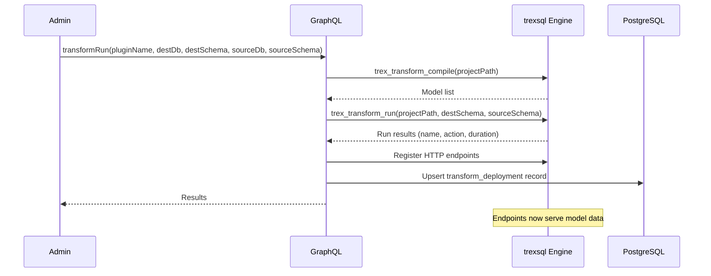

# Transform Plugins

Transform plugins define data transformation projects with SQL models, seeds, and tests. Once deployed, model results are served as HTTP endpoints in JSON, CSV, or Arrow format.

## Configuration

```json
{
  "trex": {
    "transform": {}
  }
}
```

The transform configuration block enables the plugin type. Model definitions live in a `project/` directory inside the plugin package.

## Project Structure

```
my-plugin/
├── package.json
└── project/
    ├── models/
    │   ├── staging/
    │   │   └── stg_orders.sql
    │   └── marts/
    │       └── fact_orders.sql
    ├── seeds/
    │   └── reference_data.csv
    └── tests/
        └── orders_not_null.sql
```

## Deployment Lifecycle



## HTTP Endpoints

After a successful `transformRun`, each model with an `endpoint_path` is available at:

```
GET /trex/api/plugins/transform/{pluginName}/{path}?format=json|csv|arrow
```

### Output Formats

| Format | Content-Type | Description |
|--------|-------------|-------------|
| `json` | `application/json` | JSON array of row objects (default) |
| `csv` | `text/csv` | CSV with header row |
| `arrow` | `application/vnd.apache.arrow.stream` | Apache Arrow IPC stream |

## Authorization

Transform endpoints use scope-based access control. Each model endpoint creates a scope in the pattern:

```
transform:{pluginName}:{modelName}
```

Models can declare which roles have access via the `endpoint_roles` field in the compile output. Roles are automatically registered in the authorization system. Admin users bypass all scope checks.

## GraphQL API

### Queries

```graphql
# List registered transform projects
query {
  transformProjects {
    pluginName
    projectPath
  }
}

# Compile models and check status
query {
  transformCompile(pluginName: "my-plugin") {
    name
    materialized
    order
    status
  }
}

# Preview execution plan
query {
  transformPlan(
    pluginName: "my-plugin"
    destDb: "memory"
    destSchema: "analytics"
    sourceDb: "memory"
    sourceSchema: "main"
  ) {
    name
    action
    materialized
    reason
  }
}

# Check data freshness
query {
  transformFreshness(
    pluginName: "my-plugin"
    destDb: "memory"
    destSchema: "analytics"
  ) {
    name
    status
    maxLoadedAt
    ageHours
    warnAfter
    errorAfter
  }
}
```

### Mutations

```graphql
# Run all models
mutation {
  transformRun(
    pluginName: "my-plugin"
    destDb: "memory"
    destSchema: "analytics"
    sourceDb: "memory"
    sourceSchema: "main"
  ) {
    name
    action
    materialized
    durationMs
    message
  }
}

# Load seed data
mutation {
  transformSeed(
    pluginName: "my-plugin"
    destDb: "memory"
    destSchema: "analytics"
  ) {
    name
    action
    rows
    message
  }
}

# Run tests
mutation {
  transformTest(
    pluginName: "my-plugin"
    destDb: "memory"
    destSchema: "analytics"
    sourceDb: "memory"
    sourceSchema: "main"
  ) {
    name
    status
    rowsReturned
  }
}
```

## Endpoint Recovery

Deployments are persisted in the `trex.transform_deployment` PostgreSQL table. On server restart, the system recovers previously registered endpoints by re-compiling the project and restoring routes from the stored `dest_db` and `dest_schema` values.

## Complete Example

```json
{
  "name": "@trex/analytics",
  "version": "1.0.0",
  "trex": {
    "transform": {}
  }
}
```

```
analytics/
├── package.json
└── project/
    ├── models/
    │   ├── stg_events.sql
    │   └── fact_daily_metrics.sql
    ├── seeds/
    │   └── dim_event_types.csv
    └── tests/
        └── daily_metrics_positive.sql
```
