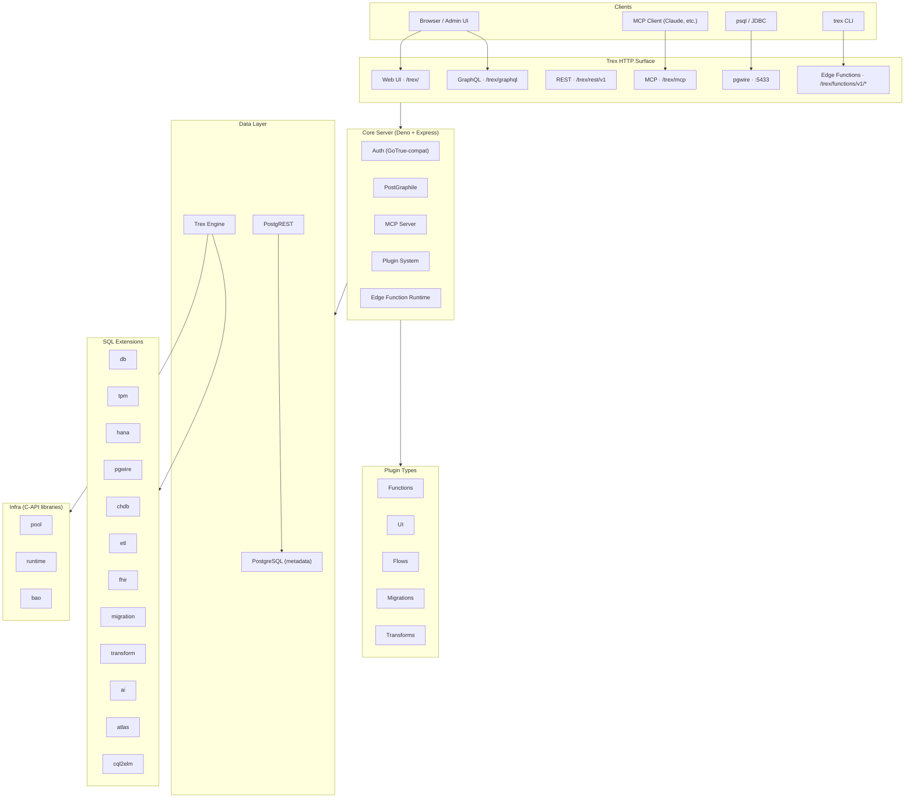
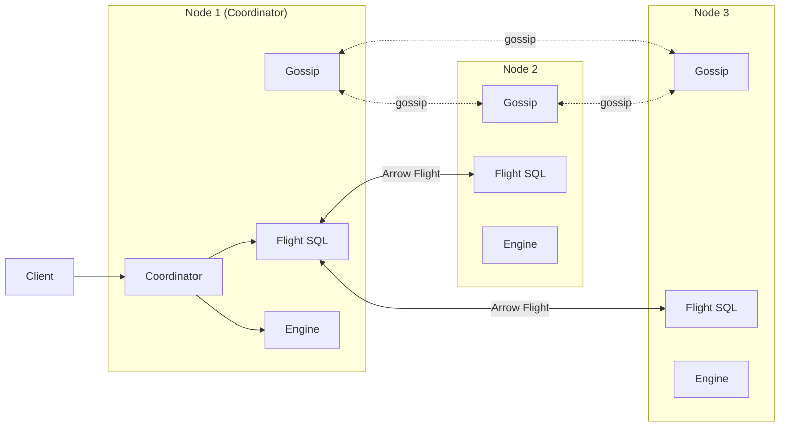

# Architecture

Trex is built around three layers that share one process tree: an analytical
column-store engine (Rust), a Deno-based core management server, and a plugin
system that lets third parties contribute UIs, APIs, flows, migrations, and
data transforms.

## Process Layout

The Rust binary (`trex`) is the process entry point. It opens a Trex catalog,
loads every `*.trex` extension out of `EXTENSION_DIR`, and starts the services
declared in `SWARM_CONFIG` — typically `trexas` (the HTTP server hosting the
core management application) and `pgwire` (the Postgres wire-protocol server).
The core server, in turn, scans plugin directories and mounts whatever each
plugin contributes.

## Three Layers

### 1. Analytical Engine

The column-store engine ships as a Rust library (`libtrexsql`, a fork of DuckDB
maintained at `p-hoffmann/trexsql-rs`) plus extensions. Extensions add
capabilities without touching the engine's core: federated catalogs,
domain-specific runtimes, and protocol servers. See [SQL Reference](../sql-reference/db)
for the user-facing extensions and [Concepts → Connection Pool](connection-pool)
for the infrastructure ones.

### 2. Core Server

The core server (`core/server/`, Deno + Express + PostGraphile) hosts the
application surface: auth, GraphQL, REST proxy (PostgREST), MCP, edge functions,
the plugin loader, and a Supabase-CLI-compatible management API. PostgreSQL
(separate from the Trex engine) backs auth and configuration state. See
[APIs](../apis/graphql) for endpoint references and [Concepts → Auth Model](auth-model)
for the auth narrative.

### 3. Plugins

Plugins are NPM packages with a `trex` block in `package.json`. Each plugin can
contribute a mix of UI assets, function workers, Prefect flows, schema
migrations, and dbt-like transformation projects. The bundled image already
ships a few — `web` (admin UI), `docs` (this site), `notebook`, `cli`, `storage`
(Supabase Storage fork), `pg-meta` (postgres-meta fork). See
[Concepts → Plugin System](plugin-system) for how plugins are discovered and
loaded; see [Plugins](../plugins/overview) for the per-type reference.

## Cluster Topology

A multi-node deployment uses a gossip protocol for membership and Arrow Flight
SQL for data transport. The default compose stack runs a single node — you must
opt in by extending `SWARM_CONFIG` to add the `flight` extension and additional
nodes.

See [Quickstart: Run a distributed cluster](../quickstarts/distributed-cluster)
for a hands-on walkthrough and [Deployment → Distributed Mode](../deployment/distributed)
for production guidance.

## Extension Catalog

Extensions live in `plugins/` and ship as `*.trex` files inside the runtime
image. Some are user-facing (you call their SQL functions); others are
infrastructure (consumed by other extensions, never directly by you).

| Extension | Type | Purpose |
|-----------|------|---------|
| [db](../sql-reference/db) | SQL | Distributed clustering, gossip, Arrow Flight, query admission, partitioning. |
| [tpm](../sql-reference/tpm) | SQL | NPM-based plugin package manager. |
| [hana](../sql-reference/hana) | SQL | SAP HANA federated reads + writes. |
| [pgwire](../sql-reference/pgwire) | SQL | Postgres wire-protocol server. |
| [chdb](../sql-reference/chdb) | SQL | ClickHouse / chdb integration. |
| [etl](../sql-reference/etl) | SQL | Postgres logical-replication CDC into Trex. |
| [fhir](../sql-reference/fhir) | SQL | FHIR R4 server backed by Trex storage. |
| [migration](../sql-reference/migration) | SQL | Schema-migration runner. |
| [transform](../sql-reference/transform) | SQL | dbt-like SQL model compile / plan / run / seed / test / freshness. |
| [ai](../sql-reference/ai) | SQL | In-process LLM inference via llama.cpp (CPU / CUDA / Vulkan / Metal). |
| [atlas](../sql-reference/atlas) | SQL | OHDSI Atlas cohort JSON → SQL via Circe. |
| [cql2elm](../sql-reference/cql2elm) | SQL | Clinical Quality Language → ELM translator. |
| pool | infra | Shared connection pool consumed by `pgwire`, `runtime`, and other extensions. |
| runtime | infra | Trex Deno runtime — host of edge function and plugin loaders. |
| bao | infra | Background async orchestrator used by `runtime` and `etl`. |

## Default Service Endpoints

With the default `BASE_PATH=/trex`, a single-node deployment exposes:

| Endpoint | URL |
|----------|-----|
| Web UI | http://localhost:8001/trex/ |
| GraphQL | http://localhost:8001/trex/graphql |
| GraphiQL | http://localhost:8001/trex/graphiql (set `ENABLE_GRAPHIQL=true`) |
| REST | http://localhost:8001/trex/rest/v1 |
| MCP | http://localhost:8001/trex/mcp |
| Edge Functions | http://localhost:8001/trex/functions/v1/&lt;slug&gt; |
| Storage | http://localhost:8001/trex/storage/v1 |
| pg-meta | http://localhost:8001/trex/pg/v1 |
| TLS | https://localhost:8000/trex/ |
| pgwire | `postgresql://localhost:5433/main` |
| Postgres metadata | `postgresql://localhost:65433/testdb` |

## Next steps

- New here? Run the [5-minute deploy quickstart](../quickstarts/deploy).
- Curious how requests flow? See [Concepts → Query Pipeline](query-pipeline).
- Building a plugin? Read [Concepts → Plugin System](plugin-system) then
  [Tutorial: Build a plugin](../tutorials/build-a-plugin).
