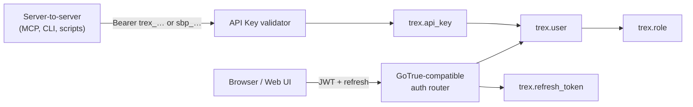
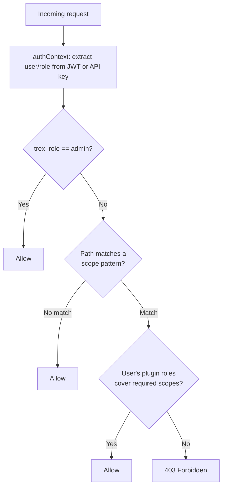
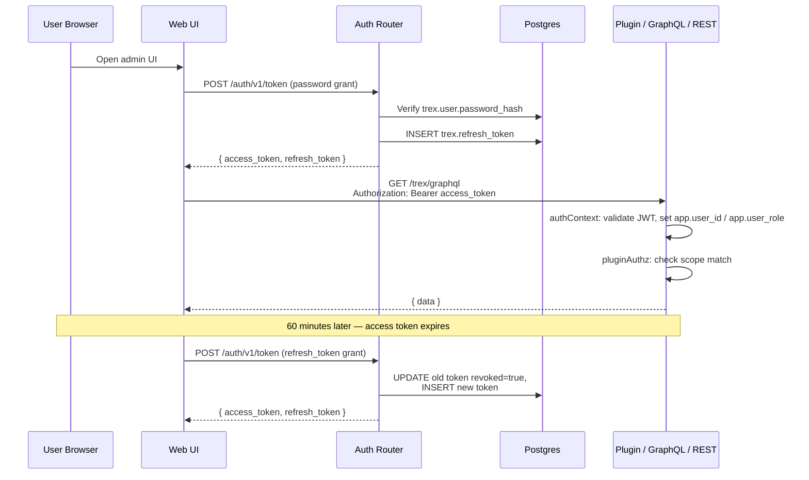

# Auth & Authorization

This page explains *how* Trex authenticates users and authorizes requests. For
the endpoint-by-endpoint reference, see [APIs → Auth](../apis/auth).

## Two Identity Surfaces

Trex carries two parallel identity surfaces, both backed by Postgres tables in
the `trex` schema:



- **Interactive sessions** issue short-lived JWT access tokens (1 hour) plus
  opaque refresh tokens. Browser-based UIs and the auth-required parts of the
  GraphQL/REST surface authenticate this way.
- **Machine-to-machine** clients (MCP, the `trex` CLI, automation scripts)
  present long-lived API keys. There are two prefixes — `trex_…` for
  server-issued keys and `sbp_…` for keys issued through the CLI device-code
  login. Both validate against `trex.api_key`.

The two surfaces share a single user table: every API key is owned by a user,
and that user's role determines what the key can do.

## What's in a JWT

When a user signs in with email + password (or refreshes a token), the auth
router signs a JWT with the following shape:

```json
{
  "sub": "<user-id>",
  "email": "alice@example.com",
  "role": "authenticated",
  "session_id": "<uuid>",
  "app_metadata": {
    "provider": "email",
    "providers": ["email"],
    "trex_role": "admin"
  },
  "user_metadata": {
    "name": "Alice",
    "image": null,
    "must_change_password": false
  },
  "exp": <unix timestamp>
}
```

The signing key is `BETTER_AUTH_SECRET` (≥32 chars). The token is consumed by
the `authContext` middleware, which extracts the `trex_role` and exposes it as
the Postgres GUC `app.user_role` for downstream queries.

## Roles & Scopes

Trex has *two* role concepts that look superficially similar but live in
different layers:

| Layer | Where | Purpose |
|-------|-------|---------|
| **System role** | `trex.user.role` (`admin` or `user`) | Determines whether the caller bypasses scope checks. |
| **Plugin roles** | `trex.role` (auto-created by plugins) | Fine-grained URL-pattern authorization for plugin routes. |

The system role is binary: admins bypass every authorization check. Non-admins
need plugin roles whose scope set covers the URL pattern they're hitting.



A plugin contributes to this model by declaring `roles` and `scopes` in its
`package.json`. Scopes are URL patterns mapped to a list of required scope
strings; roles are named bundles of scope strings. The plugin loader
auto-creates rows in `trex.role` at startup so admins can assign them via the
UI/MCP.

## Sessions & Refresh Tokens

Every interactive sign-in creates a session UUID and stores a refresh token in
`trex.refresh_token` keyed by that session. The session is the unit of
revocation: logging out, rotating a password, or revoking from
`/auth/v1/sessions` invalidates all refresh tokens tied to that session, but
leaves other sessions intact (so signing out of one device doesn't sign you out
everywhere).

Refresh tokens themselves are opaque random strings, hashed at rest. Rotation
is mandatory — using a refresh token marks it `revoked = true` and issues a new
one in the same session.

## SSO

The `/auth/v1/settings` endpoint reports which SSO providers are enabled. For
each provider, settings come from one of two sources:

1. **`trex.sso_provider`** (DB-driven) — preferred. Allows runtime
   configuration, supports Apple, and tracks per-provider client IDs.
2. **Environment variables** (`GOOGLE_CLIENT_ID`, etc.) — legacy fallback for
   bootstrap.

Enabled providers appear in the login page. The actual OAuth dance is driven
by the auth router's social provider plumbing.

## API Keys for MCP & CLI

API keys give code paths the same authorization story as user sessions, with
two simplifications:

- They never expire on a clock — they're explicitly revoked.
- They carry their owner's `trex_role`. An API key issued by an admin user
  authorizes admin-level operations; one from a regular user does not.

Trex issues two prefixes:

- `trex_<48-hex>` — created via the web UI or the `api-key-create` MCP tool.
  Targeted at MCP and other internal automation.
- `sbp_…` — created by the CLI device-code login flow. Compatible with
  `SUPABASE_ACCESS_TOKEN`-style auth; the management API accepts both prefixes
  interchangeably.

## Putting It Together



## Next steps

- See [APIs → Auth](../apis/auth) for endpoint-by-endpoint reference.
- See [Plugins → Function Plugins](../plugins/function-plugins) for how a
  plugin declares its own roles and scopes.
- See [APIs → MCP](../apis/mcp) and [CLI](../cli) for how the two API-key
  prefixes are used in practice.
