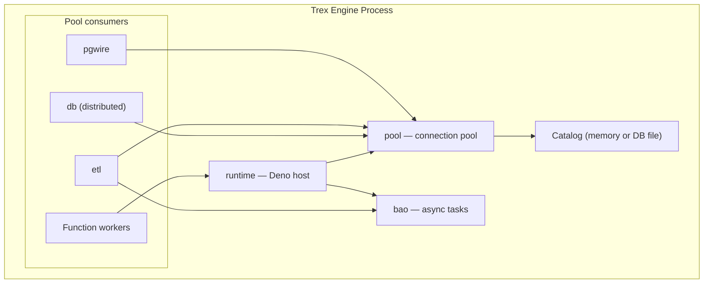

# Connection Pool & Runtime

Three "infrastructure" extensions are loaded transparently every time Trex
starts: `pool`, `runtime`, and `bao`. None of them expose user-facing SQL
functions. They're worth understanding because they shape what you observe
when running heavy workloads, debugging session-local state, or tuning
concurrency.

## The three layers

| Extension | What it is |
|-----------|------------|
| **pool** | A C-API library exposing a thread-safe connection pool over the engine. Other extensions (`pgwire`, `runtime`, `etl`) take connections from the pool instead of opening direct engine connections. |
| **runtime** | A Deno-based runtime hosted inside the engine process. Powers the edge-function workers and acts as the bridge between Express HTTP handlers and engine queries. Sits on top of `pool`. |
| **bao** | A background async orchestrator — a lightweight task scheduler used by `runtime` (for HTTP request dispatch) and `etl` (for CDC pipelines). |

The pool is initialized at startup with a fixed size (currently 64). Every
incoming pgwire connection, every transform query, and every CDC pipeline
borrows a connection from the pool, executes, and returns it.

## Sessions and pinning

Most queries are stateless: a `SELECT` doesn't modify the connection's
session state, so the pool can serve them with any free connection. But
some statements *do* modify connection-local state — `ATTACH`, temp tables,
`SET search_path`, prepared statements with parameters, transactions. Trex
handles these via three escalating strategies:

1. **Default**: a fresh borrow per statement. Reads round-robin across the
   pool.
2. **Auto-pin**: when a writeable or parameterized statement runs, the pool
   transparently pins the underlying engine connection to the *caller*
   (e.g. a specific pgwire session) for the duration of the open transaction.
   Once the transaction commits or rolls back, the connection is returned.
3. **Persistent session**: when a statement requires connection-local state
   that outlives a single transaction (`ATTACH`, temp tables, etc.), the pool
   detects this and upgrades the caller to a persistent session. The same
   underlying connection serves every subsequent statement from that caller
   until the caller disconnects.

This is invisible to the client. `psql` and JDBC see a normal Postgres session
with normal session semantics. The reason it's worth knowing: if you're
benchmarking pool sizing or debugging "why does my temp table disappear?", the
answer is in this state machine.

### Default catalog

When the pool initializes, every connection in the pool inherits the engine's
default catalog. With the default compose stack that's `memory` (in-RAM); set
`DATABASE_PATH=/data/trex.db` to use a persistent file. Clients can switch
catalogs with `USE <db>` or `SET search_path` mid-session — those are
stateful, so they trigger the auto-pin or persistent-session paths above.

## Why `runtime` exists

The Trex Deno runtime is more than a stock Deno — it embeds a connection
listener that lets edge functions invoke each other (and core server code)
through an in-process bus, bypassing the HTTP loopback. When the core server
calls a plugin function, it doesn't make an HTTP request to itself; it queues
a message on the bus, which `runtime` dispatches to the right Deno worker.

This matters in two contexts:

- **Edge functions accessing the engine**: a function calling `trex_query()`
  borrows from the same `pool`, so a function that runs an `ATTACH` will get
  a persistent session for the lifetime of that worker invocation.
- **Inter-plugin calls**: the MCP `plugin-function-invoke` tool and certain
  GraphQL operations route through this bus.

## Why `bao` exists

Async work that doesn't fit a single request-response cycle — long-running
ETL pipelines, deferred CDC ingest, periodic compaction — runs on `bao`. It's
internal scaffolding: you never call into `bao` directly, but a long-running
ETL pipeline you started via `trex_etl_start()` is a `bao`-scheduled task.

Operationally: if you see threads named `bao-*` in a profile or core dump,
they're `bao` workers, not user query threads.

## What you might tune

Today the only knob is the pool size (compiled in at 64). Future versions
may expose:

- Pool size as an env var.
- Per-pgwire-session timeout for pinned connections.
- Eviction policy for persistent sessions held by disconnected clients.

If you hit a wall on concurrency in the meantime, check `trex_db_query_status()`
for the queued/running breakdown — admission control bites before pool
exhaustion in most realistic workloads.

## Next steps

- [SQL Reference → pgwire](../sql-reference/pgwire) covers the pool/pinning
  story from the client side, plus the supported wire types.
- [SQL Reference → etl](../sql-reference/etl) is a primary `bao` consumer.
- [Concepts → Query Pipeline](query-pipeline) shows where the pool sits in the
  end-to-end request path.
