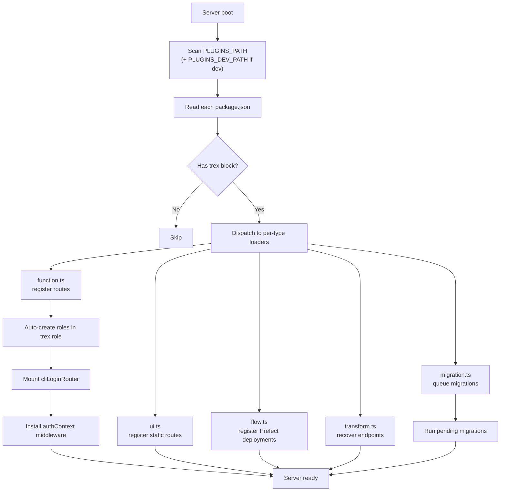
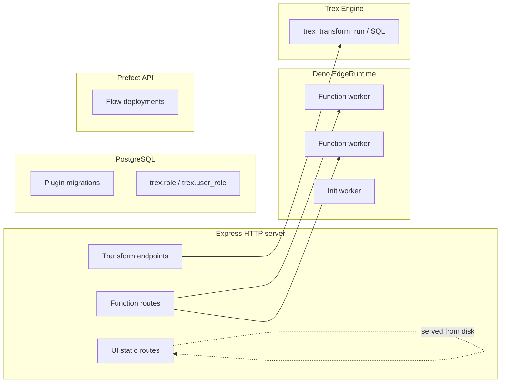

# Plugin System

Trex plugins are NPM packages that contribute to a running deployment without
forking the core. Each plugin can ship some mix of UI assets, HTTP function
workers, Prefect flows, schema migrations, and dbt-like transformation
projects. This page explains *how* the plugin loader works; for per-type
configuration syntax, see [Plugins](../plugins/overview).

## Why NPM packages

A plugin is a regular `package.json` package with a `trex` block:

```json
{
  "name": "@trex/my-plugin",
  "version": "1.0.0",
  "trex": {
    "functions": { ... },
    "ui": { ... },
    "migrations": { ... }
  }
}
```

Three things follow from "it's an NPM package":

1. **Versioning and distribution** are inherited from the npm registry — no
   custom plugin format, no custom registry.
2. **Dependencies** are resolved by `tpm` (Trex's package manager) the same way
   `npm install` resolves them, so plugins can depend on each other.
3. **Discovery** is a directory scan: any `package.json` with a `trex` block
   inside `PLUGINS_PATH` (or `PLUGINS_DEV_PATH` in dev) is a plugin.

## Discovery and loading



Each loader lives in `core/server/plugin/<type>.ts` and is responsible for one
plugin type's lifecycle. The plugin's package directory becomes the working
directory for path resolution — `trex.functions.api[0].function = "/foo.ts"`
means `<plugin-dir>/foo.ts`.

## Five plugin types

| Type | Loader | What it adds |
|------|--------|--------------|
| **Function** | `plugin/function.ts` | HTTP endpoints powered by Deno EdgeRuntime workers. Each worker runs in isolation with configurable env vars, Deno permissions, and an optional ESZIP bundle. |
| **UI** | `plugin/ui.ts` | Static frontend assets and admin-shell sidebar entries. Supports plain static-file serving, single-page-app fallback, and the single-spa micro-frontend protocol. |
| **Migration** | `plugin/migration.ts` | Ordered SQL migrations executed against `DATABASE_URL` (Postgres). Each migration runs once, tracked in a per-plugin `_migrations` table. |
| **Flow** | `plugin/flow.ts` | Prefect deployments registered against `PREFECT_API_URL`. The image, work pool, concurrency limits, and image-tag overrides are read from the plugin config. |
| **Transform** | `plugin/transform.ts` | dbt-like SQL projects whose models compile, materialize, and serve as JSON / CSV / Arrow HTTP endpoints. Endpoints persist across restarts via `trex.transform_deployment`. |

A single plugin can contribute multiple types — most non-trivial plugins
combine UI + functions + migrations.

## Authorization model

Plugins shape Trex's authorization in two ways:

1. **`trex.functions.roles`** declares named scope bundles. The loader merges
   these into a global `ROLE_SCOPES` map and auto-creates rows in `trex.role`
   so they're assignable from the admin UI / MCP.
2. **`trex.functions.scopes`** declares URL-pattern → required-scope mappings.
   The loader prepends them to a global pattern list checked by the
   `pluginAuthz` middleware.

Admin users bypass every scope check. Non-admins must hold a role whose scope
set covers the matched pattern. The first matching pattern wins, so order
entries from most specific to least specific.

See [Concepts → Auth Model](auth-model) for the broader auth narrative.

## What runs where



Every layer is independent — a plugin that registers only UI routes never
touches Deno workers, and a migration-only plugin never appears in the HTTP
surface. The loaders fail open: if one plugin's loader throws, the others
still run.

## Plugin installation

Three install paths, all converging on the same on-disk layout under
`PLUGINS_PATH`:

- **Bundled** in the runtime image during `docker build`.
- **Installed at runtime** via the `trex_plugin_install_with_deps()` SQL
  function (the `tpm` extension), which resolves dependencies against
  `TPM_REGISTRY_URL`.
- **Mounted from disk** via a bind mount in `docker-compose.dev.yml` for
  development.

After install, the server re-scans the plugin directory on the next restart.
There is no live hot-reload of plugin code (only of dev-mounted files).

## Next steps

- [Plugins → Overview](../plugins/overview) for per-type configuration syntax.
- [Tutorial: Build a plugin](../tutorials/build-a-plugin) for a working
  example you can copy.
- [SQL Reference → tpm](../sql-reference/tpm) for the package-manager
  extension's SQL surface.
