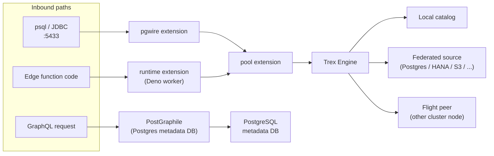
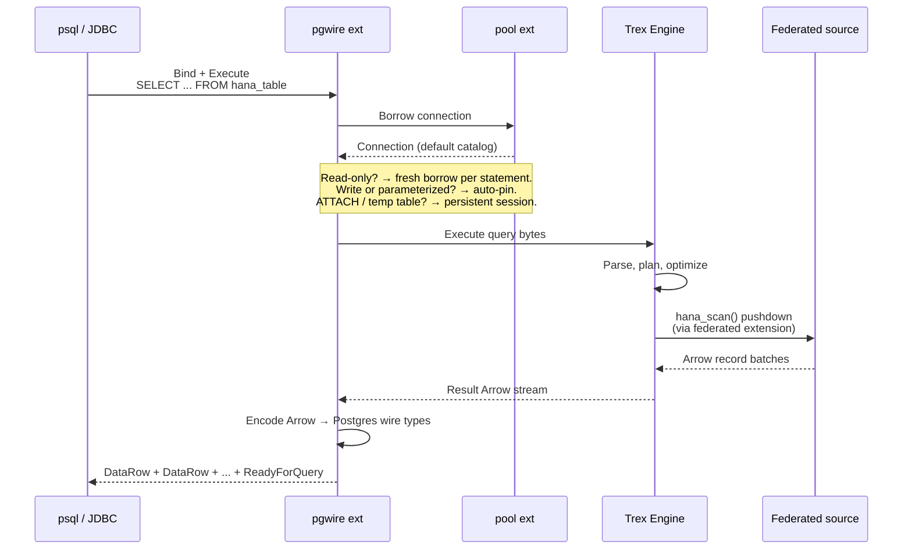
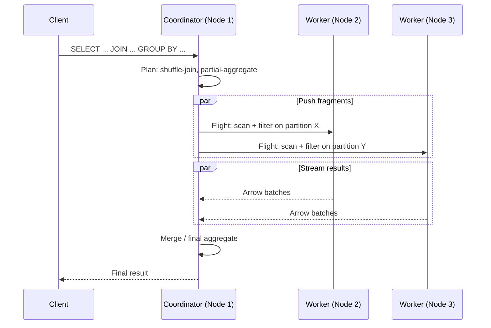
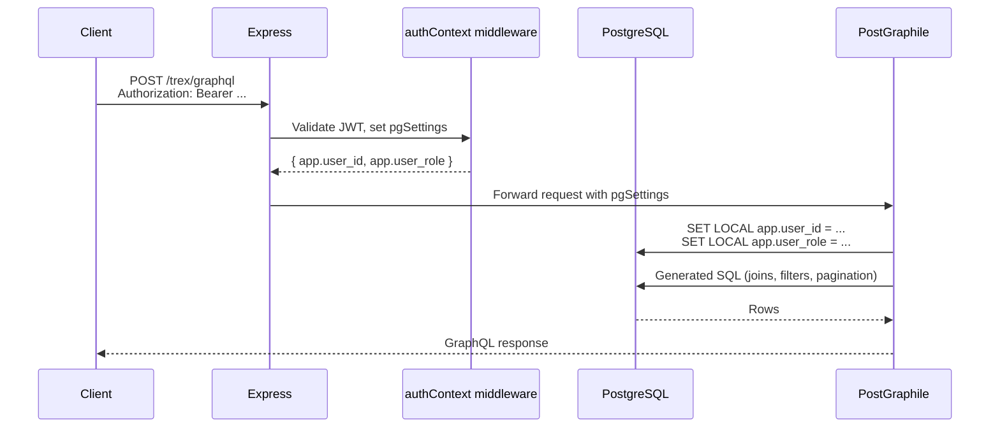
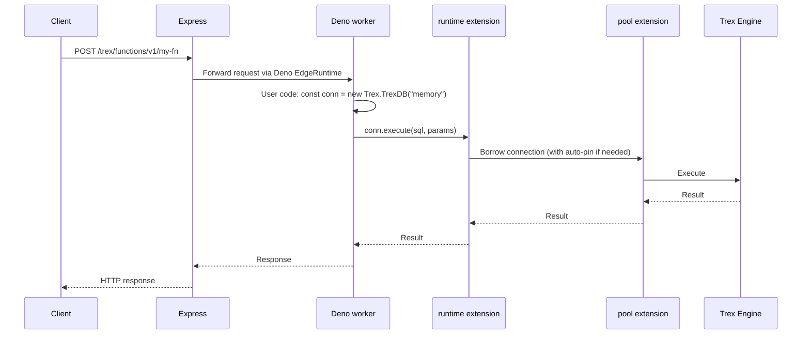

# Query Pipeline

This page traces a single query end-to-end. It's the explanation that pairs
with [Concepts → Architecture](architecture) (which covers the static
component layout) and [Concepts → Connection Pool](connection-pool) (which
covers the connection state machine).

## Three entry paths

A query can enter Trex through three doors. They converge at the engine but
have different contracts on the way in.

The pgwire and edge-function paths terminate at the analytical engine. The
GraphQL path terminates at PostgreSQL — the management database — which is
deliberately *separate* from the engine. Trex doesn't auto-promote GraphQL
queries to the engine; if you want analytical queries via HTTP, expose them
through transform endpoints, plugin functions, or the REST proxy onto a
trexsql catalog you've configured.

## A pgwire query, step by step

Three things worth pulling out:

1. **Federation is pushed into the engine, not the pgwire layer.** The wire
   server doesn't know that `hana_table` lives on SAP HANA. It hands the
   query to the engine, which dispatches the appropriate scan.
2. **Encoding happens at the boundary.** The engine speaks Arrow internally;
   the pgwire layer translates Arrow types into Postgres wire types
   (see [SQL Reference → pgwire](../sql-reference/pgwire) for the full
   mapping).
3. **Pool borrow strategy is decided per statement.** The `Note` above
   summarizes the decision tree from
   [Concepts → Connection Pool](connection-pool).

## A distributed query (multi-node)

When the `db` extension's distributed mode is active, the engine consults
the gossip catalog to plan cross-node execution.

This is a sketch — the actual planner choices (broadcast vs. shuffle, partial
vs. global aggregate) are documented in `specs/003-ballista-duckdb-distributed/`.

## A GraphQL query (PostGraphile path)

Custom mutations (the `pluginOperationsPlugin` operations like
`installPlugin`, `transformRun`, `runPluginMigrations`) intercept this path
and dispatch to the engine, the plugin loader, or external services as
appropriate. Most of those mutations enforce `app.user_role = 'admin'` — see
[Concepts → Auth Model](auth-model) for the broader story.

## An edge function calling SQL

The function's connection lives only as long as the worker invocation. If the
function uses `ATTACH` or temp tables, those persist across statements within
the same invocation (via the persistent-session path) but are torn down when
the worker exits.

## Failure modes worth knowing

- **Pool exhaustion**: if all 64 pool connections are held by long-running
  pinned sessions, new statements queue. Admission control (see
  `trex_db_query_status()`) typically bites before this matters in practice,
  but it's the next thing to investigate when concurrency stalls.
- **Federation latency**: a query against a federated source is bounded by
  that source's response time. Push as much filtering and projection into the
  scan as possible — the engine handles `WHERE` and `SELECT` pushdown for
  most federated extensions.
- **Cross-cluster Flight failures**: a worker node going dark mid-query
  surfaces as a Flight stream error in the coordinator. The coordinator does
  not retry; the client sees an error and re-issues.

## Next steps

- [Concepts → Connection Pool](connection-pool) for the borrow strategy in
  more depth.
- [SQL Reference → db](../sql-reference/db) for the distributed-query SQL
  surface.
- [Quickstart: Run a distributed cluster](../quickstarts/distributed-cluster)
  for a working two-node setup.
