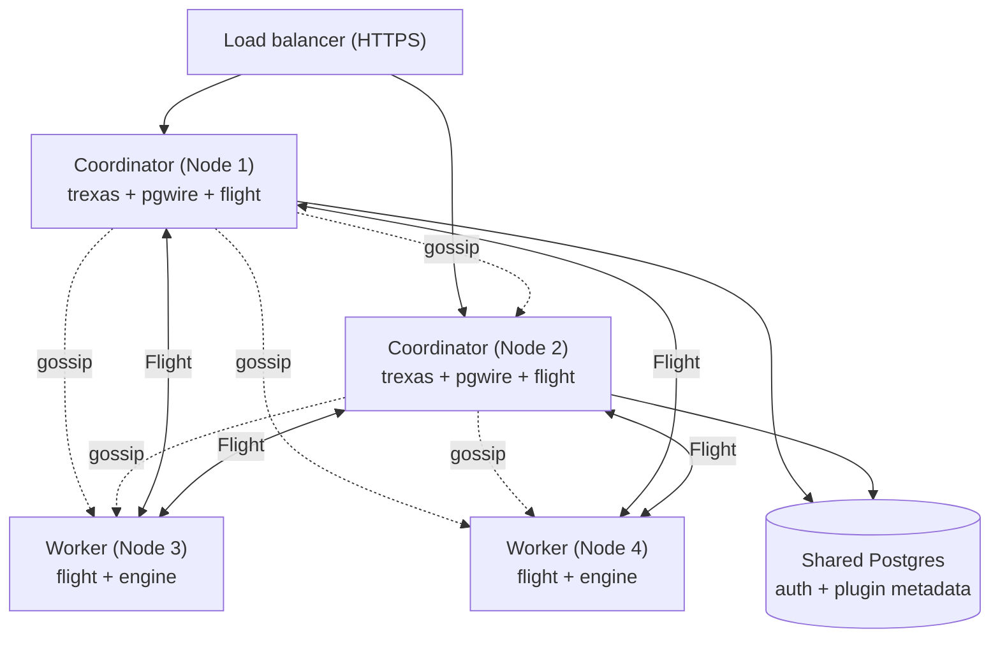

# Distributed Mode

Distributed deployment runs Trex across multiple nodes for horizontal scale.
Membership uses a gossip protocol; data movement uses Arrow Flight SQL. This
page covers production guidance — for a hands-on walkthrough see
[Quickstart: Run a distributed cluster](../quickstarts/distributed-cluster).

:::info
Distributed mode is opt-in and the planner / shuffle / partitioning subsystem
is still maturing — the design lives in `specs/003-ballista-duckdb-distributed/`
in the repo. Current production users typically run single-node Trex with
federated queries; distributed mode is best validated on representative
workloads before committing.
:::

## Topology

A typical production topology:



Roles:

- **Coordinators** run `trexas` (the HTTP server) and `pgwire`. They accept
  client connections, plan queries, and dispatch fragments to workers via
  Flight.
- **Workers** run only `flight` and the engine. They hold partitions, execute
  scan / filter / partial-aggregate fragments, and stream Arrow batches back
  to the coordinator.
- **Shared Postgres** stores auth, plugin metadata, and configuration. Every
  coordinator points at the same `DATABASE_URL`.

Small clusters (2-4 nodes) often colocate coordinator + worker on every node.
Larger clusters split them so coordinators scale with HTTP / pgwire traffic
and workers scale with data volume.

## SWARM_CONFIG

Each node receives the *same* `SWARM_CONFIG` JSON describing the whole
cluster, plus a per-node `SWARM_NODE` env var that picks its identity:

```json
{
  "cluster_id": "prod",
  "nodes": {
    "coord-1": {
      "gossip_addr": "0.0.0.0:4200",
      "extensions": [
        {"name":"trexas","config":{"host":"0.0.0.0","port":8001, ...}},
        {"name":"pgwire","config":{"host":"0.0.0.0","port":5432}},
        {"name":"flight","config":{
          "host":"0.0.0.0","port":8815,
          "tls_cert_path":"/certs/server.crt",
          "tls_key_path":"/certs/server.key",
          "ca_cert_path":"/certs/ca.crt"
        }}
      ]
    },
    "coord-2": { "...": "same shape, references coord-1 as seed" },
    "worker-1": {
      "gossip_addr": "0.0.0.0:4200",
      "seeds": ["coord-1.internal:4200"],
      "extensions": [
        {"name":"flight","config":{ ... }}
      ]
    }
  }
}
```

The first node bootstraps without seeds. Every other node must list at least
one already-running peer in `seeds` (use coordinator hostnames, since
coordinators are first to start in the rolling deploy).

## TLS for Flight

Cross-node Flight traffic carries query data — terminate it with TLS in any
non-trusted network. Use `flight_start_tls` (configured automatically when
`tls_cert_path` / `tls_key_path` / `ca_cert_path` are set in the extension's
config block).

The coordinator validates worker certificates against `ca_cert_path`. Use a
private CA or your cloud's managed PKI; mTLS is supported by also setting
`require_client_cert: true`.

## Persistent catalogs

Set `DATABASE_PATH` on each worker so its partition state survives restarts:

```yaml
environment:
  DATABASE_PATH: /data/trex.db
volumes:
  - worker-1-data:/data
```

A worker's catalog is its identity from the planner's perspective — restarting
a worker with a fresh catalog effectively wipes its partitions, and the
coordinator will start re-planning around the missing data on the next query.
Make `/data` durable.

## Rolling restarts

Gossip handles transient node loss (default detection: ~10s). For zero-impact
rolling restarts:

1. **Coordinators** can be cycled freely as long as the load balancer drains
   in-flight HTTP connections before SIGTERM. pgwire connections are not
   gracefully drained — clients will see a connection drop and must
   reconnect.
2. **Workers** holding partitions: drain by setting `data_node = false` on
   the worker before stopping it. The coordinator stops scheduling fragments
   to a non-data node:

   ```sql
   -- on the worker's pgwire endpoint
   SELECT trex_db_set('data_node', 'false');
   ```

   Wait for `trex_db_query_status()` to show no in-flight queries on that
   node, then stop it. After restart, set `data_node = true` again to re-add
   it to scheduling.

## Observability

Three SQL functions cover the distributed surface:

- `trex_db_nodes()` — gossip view of the cluster.
- `trex_db_cluster_status()` — aggregate query / memory / queue stats.
- `trex_db_metrics()` — per-metric values for Prometheus-style scraping.

Plumb these through a periodic job into your metrics store. The admin UI's
Cluster page reads them directly via the GraphQL `trexNodes` /
`trexClusterStatus` queries.

## Sizing guidance

These are starting points, not load-tested guarantees:

| Workload | Coordinators | Workers | Notes |
|----------|--------------|---------|-------|
| < 100 GB, < 10 QPS | 1 (colocated) | 0 | Single-node; distributed not needed. |
| 100 GB - 1 TB, < 50 QPS | 1 | 2-3 | Split coord/worker; partition by ingestion key. |
| 1 - 10 TB, mixed | 2 (HA) | 4-8 | TLS-on-Flight required; consider per-AZ workers. |
| 10+ TB | 2-3 | 8+ | Custom sizing; reach out / file a tracking issue. |

Memory rules of thumb: workers should have 4-8x the partition's typical
working-set size. Coordinators are mostly idle (planner + gossip) until
queries fan out — 4-8 GB is plenty for small clusters.

## Production checklist

- [ ] Shared Postgres is HA (RDS Multi-AZ, Cloud SQL HA, or self-managed Patroni).
- [ ] Persistent volumes for every worker's `DATABASE_PATH`.
- [ ] Flight TLS terminated with managed certs (cert-manager / ACM / etc.).
- [ ] HTTPS load balancer in front of coordinators.
- [ ] Backup strategy: `trex` catalogs aren't currently backed up by `pg_dump`
      — back up the worker volumes directly, or replicate critical data into
      Postgres with the `etl` extension.
- [ ] Metrics scraping: `trex_db_metrics()` polled into Prometheus / cloud
      monitoring.
- [ ] Alerts on `trex_db_nodes()` showing nodes with `status != 'alive'`.

## Next steps

- [Quickstart: Run a distributed cluster](../quickstarts/distributed-cluster) for
  a working two-node compose file.
- [SQL Reference → db](../sql-reference/db) for every distributed-query
  function.
- [Concepts → Query Pipeline](../concepts/query-pipeline) for how queries
  flow across nodes.
- The `specs/003-ballista-duckdb-distributed/` directory in the repo for the
  in-progress technical spec.
