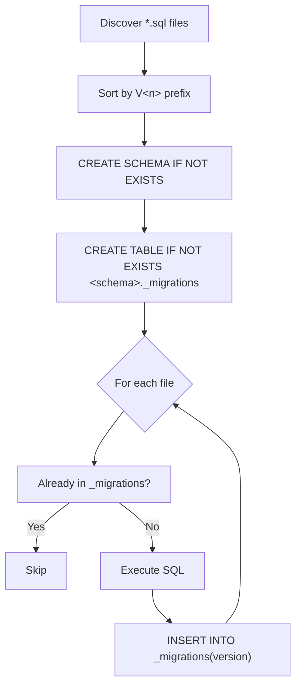

# Migration Plugins

Migration plugins manage SQL schema migrations for plugin-specific schemas. Each
plugin's `migrations/` directory is scanned at server startup and pending versions
are executed in order against the configured Postgres database.

## Configuration

```json
{
  "trex": {
    "migrations": {
      "schema": "my_plugin",
      "database": "_config"
    }
  }
}
```

| Field | Type | Default | Description |
|-------|------|---------|-------------|
| `schema` | string | *(required)* | Target schema. Created automatically if absent. Must match `^[A-Za-z_][A-Za-z0-9_]{0,62}$` (unquoted Postgres identifier). |
| `database` | string | `_config` | Target database. Currently only `_config` (the Postgres metadata DB pointed at by `DATABASE_URL`) is supported by the plugin runner. |

Migration files live in a `migrations/` directory inside the plugin package.

## File Naming Convention

Migration files follow the pattern `V<version>__<name>.sql`:

```
migrations/
├── V1__create_tables.sql
├── V2__add_indexes.sql
└── V3__seed_data.sql
```

**Rules:**
- Filename ends with `.sql`.
- The leading `V<number>` prefix determines execution order — files are sorted by
  the integer parsed out of `^V(\d+)`.
- The full filename (without `.sql`) is the version key recorded in the history
  table, so two files cannot share an identical name.
- Files that do not end in `.sql` are silently skipped.

## Execution Lifecycle



## History Table

Each schema gets a `<schema>._migrations` table tracking applied versions:

| Column | Type | Description |
|--------|------|-------------|
| `version` | TEXT (PK) | Migration version key (filename without `.sql`). |
| `applied_at` | TIMESTAMPTZ | Defaults to `NOW()` when the row is inserted. |

The runner does not currently compute or verify checksums — re-applying a modified
migration file is a no-op once its version is recorded. If you need to re-run a
modified migration, drop or update the corresponding `_migrations` row first.

## Automatic Execution

`runAllPluginMigrations()` is called once at server startup, after plugin discovery
and before the server begins accepting requests. It opens a dedicated `pg.Pool`
against `DATABASE_URL` (with optional TLS via `DB_TLS_CA_PATH` / `DB_TLS_INSECURE`),
runs every registered plugin's pending migrations, then closes the pool.

If `DATABASE_URL` is unset, plugin migrations are skipped with a warning.

## Manual Execution

Run migrations on demand via GraphQL:

```graphql
# Run pending migrations for a specific plugin
mutation {
  runPluginMigrations(pluginName: "my-plugin") {
    success
    error
    results {
      version
      name
      status
      appliedOn
    }
  }
}

# Run pending migrations for every registered plugin
mutation {
  runPluginMigrations {
    success
    error
  }
}
```

The MCP tool `migration-run` exposes the same operation.

## Monitoring

```graphql
query {
  trexMigrations {
    pluginName
    schema
    database
    currentVersion
    totalMigrations
    appliedCount
    pendingCount
    migrations {
      version
      name
      status
      appliedOn
    }
  }
}
```

## Error Handling

| Error | Cause | Resolution |
|-------|-------|------------|
| `invalid migration config (missing schema)` | `schema` field absent or non-string | Add a valid `schema` to `trex.migrations`. |
| `invalid schema name` | Schema fails the identifier regex | Rename to a plain unquoted identifier. |
| `DATABASE_URL not set — skipping plugin migrations` | Server has no Postgres URL | Set `DATABASE_URL` (or `EXTERNAL_DB_URL` / `POOLER_URL`). |
| SQL execution error | A statement in the migration failed | Fix the SQL, drop the `_migrations` row if already recorded, restart. |
| Directory not found | `migrations/` directory missing | Create it. Plugins without migration directories simply log no work. |

## Complete Example

```json
{
  "name": "@trex/my-plugin",
  "version": "1.0.0",
  "trex": {
    "migrations": {
      "schema": "my_plugin",
      "database": "_config"
    }
  }
}
```

```
my-plugin/
├── package.json
└── migrations/
    ├── V1__create_tables.sql
    ├── V2__add_indexes.sql
    └── V3__add_audit_columns.sql
```
