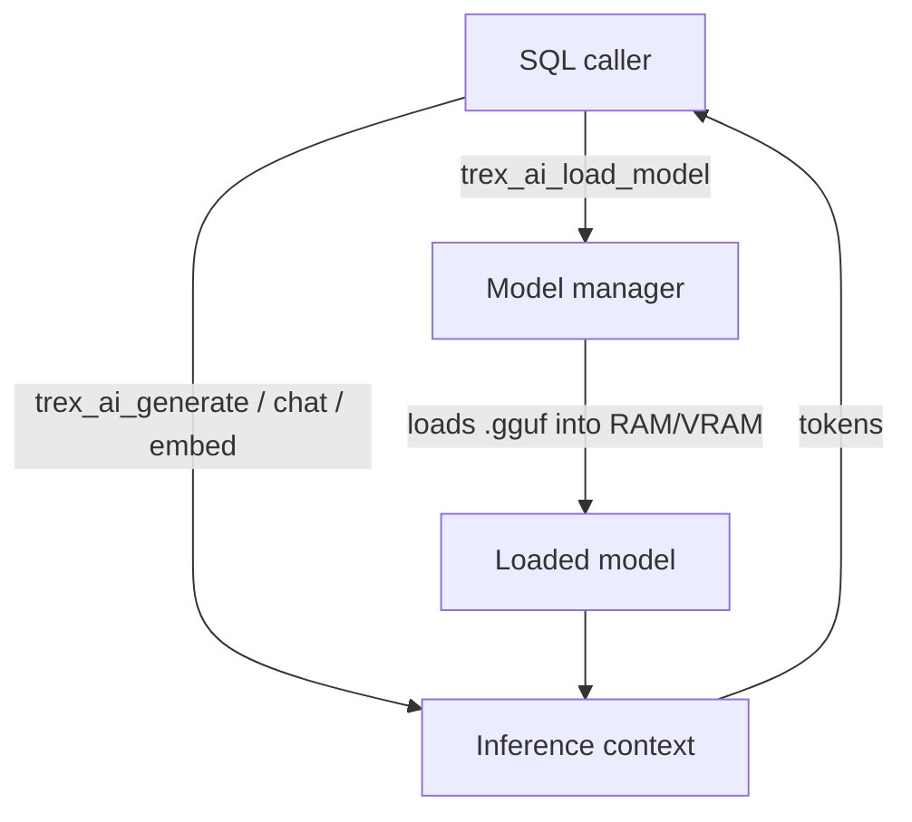

# ai — In-Process LLM Inference

The `ai` extension runs LLM inference inside the Trex process via
[llama.cpp](https://github.com/ggml-org/llama.cpp). It supports text
generation, chat-format prompting, and embeddings, with optional GPU
acceleration (CUDA, Vulkan, Metal). Models are loaded once and held in
memory; subsequent calls reuse the loaded weights.

Use it when you want LLM output to appear *inside* a SQL pipeline — alongside
analytical queries, transform models, or batch jobs — without round-tripping
to an external API. For interactive chat or production-scale traffic to a
managed model, prefer a dedicated inference server.

## How it works



Models are GGUF format — quantized weights compatible with llama.cpp. Smaller
quantizations (Q4_K_M) trade quality for speed and memory; Q8_0 sits in
between. The extension auto-selects CPU or GPU based on the build (CUDA,
Vulkan, or Metal) and what's available at runtime.

A pool of inference contexts is shared across concurrent calls — see
`trex_ai_context_pool_status()`. Long prompts hold a context for the
duration of the call; short prompts complete fast and free the context.

## Typical workflow

```sql
-- One-time: download a model from Hugging Face
SELECT trex_ai_download_model(
  'TheBloke/Llama-2-7B-Chat-GGUF',
  'llama-2-7b-chat.Q4_K_M.gguf',
  '/models'
);

-- Load into memory under an alias
SELECT trex_ai_load_model('chat', '/models/llama-2-7b-chat.Q4_K_M.gguf');

-- Generate text
SELECT trex_ai_generate(
  'chat',
  'Summarize the OMOP CDM in two sentences.',
  '{"temperature": 0.7, "max_tokens": 256}'
);

-- For embeddings, load a separate embedding-optimized model
SELECT trex_ai_load_model_for_embeddings('embed', '/models/nomic-embed.gguf');

-- Use it in a vector search pipeline
SELECT trex_ai_embed('embed', 'patient note about diabetes diagnosis');

-- Watch resource usage
SELECT trex_ai_status();
SELECT trex_ai_gpu_info();
```

## Functions

### Model management

#### `trex_ai_list_models(path)`

Enumerate `.gguf` files under a directory along with size and metadata.

```sql
SELECT trex_ai_list_models('/models');
```

#### `trex_ai_download_model(repo, model_name, output_dir)`

Download a model file from a Hugging Face repository. Resumable; no-op if
the file already exists at the target path with matching size.

```sql
SELECT trex_ai_download_model(
  'TheBloke/Llama-2-7B-GGUF',
  'llama-2-7b.Q4_K_M.gguf',
  '/models'
);
```

#### `trex_ai_load_model(model_name, model_path)`

Load a model into memory under an alias. The alias is what subsequent
inference calls reference. Loading is synchronous and can take seconds for
large models.

```sql
SELECT trex_ai_load_model('llama2', '/models/llama-2-7b.Q4_K_M.gguf');
```

#### `trex_ai_load_model_for_embeddings(model_name, model_path)`

Same as `load_model` but configures the model for embedding output (causal
attention disabled, last hidden state exposed). Use with embedding models
like `nomic-embed-text` or `bge-large-en`.

```sql
SELECT trex_ai_load_model_for_embeddings('embed-model', '/models/nomic-embed.gguf');
```

A model loaded for embeddings cannot also be used for generation — load
twice under different aliases if you need both.

#### `trex_ai_unload_model(model_name)`

Free the model's memory.

```sql
SELECT trex_ai_unload_model('llama2');
```

#### `trex_ai_list_loaded()`

Report every loaded model with its alias, size, and whether it's the
generation or embedding variant.

```sql
SELECT trex_ai_list_loaded();
```

#### `trex_ai_model_info(model_name)`

Return architecture metadata for a loaded model: parameter count, context
length, vocabulary size, quantization type.

```sql
SELECT trex_ai_model_info('llama2');
```

### Inference

#### `trex_ai_generate(model_name, prompt, options)`

Single-prompt text completion. `options` is a JSON object — common keys:

| Option | Default | Description |
|--------|---------|-------------|
| `temperature` | 0.7 | Sampling temperature. Lower = more deterministic. |
| `top_p` | 0.9 | Nucleus sampling cutoff. |
| `top_k` | 40 | Top-k sampling. |
| `max_tokens` | 256 | Output length cap. |
| `stop` | — | Array of stop sequences. |
| `seed` | random | Reproducibility seed. |

```sql
SELECT trex_ai_generate(
  'llama2',
  'Explain SQL joins in one paragraph.',
  '{"temperature": 0.3, "max_tokens": 200, "stop": ["\n\n"]}'
);
```

#### `trex_ai_chat(model_name, messages, options)`

Chat-format inference. `messages` is a JSON array of `{role, content}`
objects (`system`, `user`, `assistant`). The extension applies the model's
chat template if available.

```sql
SELECT trex_ai_chat(
  'llama2',
  '[
    {"role":"system","content":"You are a SQL expert."},
    {"role":"user","content":"What is trexsql?"}
  ]',
  '{"temperature": 0.5}'
);
```

#### `trex_ai_embed(model_name, text)`

Generate an embedding vector for the input text. Returns a JSON array of
floats. Pair with the engine's HNSW vector index for similarity search.

```sql
SELECT trex_ai_embed('embed-model', 'patient diagnosis note');
```

#### `trex_ai(query)`

Convenience shorthand using a default loaded model. Useful in interactive
sessions; prefer `trex_ai_generate` in code so the model is explicit.

```sql
SELECT trex_ai('Summarize: SELECT * FROM users');
```

### Batch processing

For high-throughput pipelines, submit many prompts asynchronously and
collect results when they complete.

#### `trex_ai_batch_process(batch_json)`

Submit a batch and get a batch ID back. Workers process the batch in
parallel using the inference context pool.

```sql
SELECT trex_ai_batch_process(
  '{"model":"llama2","prompts":[
     {"id":"p1","prompt":"hello"},
     {"id":"p2","prompt":"world"}
   ],"options":{"temperature":0.7}}'
);
-- → "batch-abc-123"
```

#### `trex_ai_batch_result(batch_id)`

Retrieve completed results. Returns null fields for prompts still in flight.

```sql
SELECT trex_ai_batch_result('batch-abc-123');
```

### System status

The status functions return JSON strings; cast to `JSON` for ergonomics in
SQL.

| Function | What it tells you |
|----------|-------------------|
| `trex_ai_status()` | Overall: model count, GPU on/off, queue depth. |
| `trex_ai_gpu_info()` | Per-GPU: name, total VRAM, used VRAM, compute capability. |
| `trex_ai_metrics()` | Tokens/sec, request latency p50/p95/p99, queue wait. |
| `trex_ai_memory_status()` | Per-loaded-model RAM and VRAM usage. |
| `trex_ai_context_pool_status()` | Active vs idle inference contexts. |
| `trex_ai_cleanup_contexts()` | Force release of idle contexts. |
| `trex_ai_openssl_version(version_type)` | Linked OpenSSL version. Diagnostic only. |

## Operational notes

- **Pick the right quantization.** Q4_K_M is the sweet spot for most
  consumer GPUs and CPU inference. Q8_0 doubles memory but tightens
  generation quality. F16 is generally not worth it on CPU.
- **GPU detection at startup.** The extension picks CUDA → Vulkan → Metal →
  CPU based on the build flags. To verify what's active in production,
  call `trex_ai_gpu_info()` after the first generation.
- **Memory accounting.** Loaded models consume RAM (or VRAM) outside the
  Trex catalog allocator. Account for this in pod sizing — a 7B Q4_K_M model
  is ~4 GB on disk and ~5 GB resident.
- **Context length matters.** Generation cost scales with context — if you
  paste 8 KB of prior conversation into every call, latency follows. Trim
  history aggressively in chat workflows.
- **Concurrency**: each in-flight call holds one inference context. Batch
  for throughput; long prompts under high concurrency will queue.

## Next steps

- [SQL Reference → fhir](fhir) — common pairing: pull clinical text out of
  FHIR resources, embed with `trex_ai_embed`, semantic-search.
- [Concepts → Query Pipeline](../concepts/query-pipeline) — how `ai`
  inference sits in a query plan (it's a regular scalar/table function — the
  planner doesn't reorder around it).
