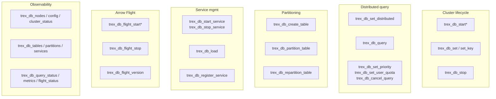

# db — Distributed Engine

The `db` extension is the cluster control plane. It owns gossip-based
membership, Arrow Flight SQL transport, distributed query planning,
table partitioning, admission control, and the metrics surface for the
whole cluster. Every function is a SQL entry point into one of those
subsystems.

This page is dense — 32 functions across seven groups. Use the structure
below to navigate; for the conceptual model see
[Concepts → Architecture → Cluster Topology](../concepts/architecture#cluster-topology)
and [Concepts → Query Pipeline](../concepts/query-pipeline).

## What `db` does



## Three cluster lifecycles

The function set covers three different deployment shapes:

1. **Single node, services only.** You don't need gossip or Flight. Just
   start `trexas` and `pgwire` from `SWARM_CONFIG`. The default Docker
   compose works this way; nothing in this extension is involved.
2. **Multi-node cluster.** Each node calls `trex_db_start_seeds` (referencing
   peers) so gossip can converge. Each node starts a `flight` service. Set
   `trex_db_set_distributed(true)` on at least one coordinator. Now
   distributed queries work — see
   [Quickstart: Run a distributed cluster](../quickstarts/distributed-cluster).
3. **Cluster managed entirely by `SWARM_CONFIG`.** In production, you usually
   don't call `trex_db_start*` from SQL — the Trex binary does it for you at
   startup based on the JSON in `SWARM_CONFIG`. The functions here are then
   only for runtime adjustment (toggling distributed mode, partitioning new
   tables, querying status).

## Typical workflows

### Bring up a two-node cluster from SQL

```sql
-- On node-1
SELECT trex_db_start('0.0.0.0', 4200, 'my-cluster');
SELECT trex_db_flight_start('0.0.0.0', 8815);
SELECT trex_db_set('data_node', 'true');

-- On node-2
SELECT trex_db_start_seeds(
  '0.0.0.0', 4200, 'my-cluster',
  'node-1.internal:4200'
);
SELECT trex_db_flight_start('0.0.0.0', 8815);
SELECT trex_db_set('data_node', 'true');

-- On either node, verify
SELECT * FROM trex_db_nodes();

-- Enable distributed query planning
SELECT trex_db_set_distributed(true);
```

### Partition an existing table for cluster execution

```sql
-- Hash-partition a table by user_id into 4 partitions
SELECT trex_db_partition_table(
  'memory.main.events',
  '{"strategy":"hash","column":"user_id","num_partitions":4}'
);

-- Or create a new partitioned table from scratch
SELECT trex_db_create_table(
  'CREATE TABLE events (id BIGINT, user_id BIGINT, ts TIMESTAMP)',
  '{"strategy":"hash","column":"user_id","num_partitions":4}'
);

-- Inspect placement
SELECT * FROM trex_db_partitions();
```

Supported strategies:

| Strategy | Config |
|----------|--------|
| `hash` | `{"strategy":"hash","column":"<col>","num_partitions":N}` |
| `range` | `{"strategy":"range","column":"<col>","ranges":["v1","v2",...]}` |

### Manage workload concurrency

```sql
-- Throttle a noisy user to 5 concurrent queries
SELECT trex_db_set_user_quota('user-123', 5);

-- Mark this session as low-priority (yields to interactive traffic)
SELECT trex_db_set_priority('batch');

-- Find a runaway query and cancel it
SELECT * FROM trex_db_query_status() WHERE status = 'running';
SELECT trex_db_cancel_query('q-abc-123');
```

Priority values: `batch` (lowest) | `interactive` (default) | `system` (highest).

### Observe what's happening

```sql
SELECT * FROM trex_db_cluster_status();   -- one-row summary
SELECT * FROM trex_db_nodes();            -- gossip view
SELECT * FROM trex_db_services();         -- per-node running services
SELECT * FROM trex_db_metrics();          -- Prometheus-style metric stream
SELECT * FROM trex_db_query_status();     -- queue + active queries
```

`trex_db_metrics` is the function to plumb into your monitoring stack.

## Cluster Management

### `trex_db_start(host, port, cluster_id)`

Start the gossip protocol and join a cluster.

| Parameter | Type | Description |
|-----------|------|-------------|
| host | VARCHAR | Bind address |
| port | INTEGER | Gossip port |
| cluster_id | VARCHAR | Cluster identifier |

**Returns:** VARCHAR

```sql
SELECT trex_db_start('0.0.0.0', 7946, 'my-cluster');
```

### `trex_db_start_seeds(host, port, cluster_id, seeds)`

Start the gossip protocol with known seed nodes.

| Parameter | Type | Description |
|-----------|------|-------------|
| host | VARCHAR | Bind address |
| port | INTEGER | Gossip port |
| cluster_id | VARCHAR | Cluster identifier |
| seeds | VARCHAR | Comma-separated seed addresses |

**Returns:** VARCHAR

```sql
SELECT trex_db_start_seeds('0.0.0.0', 7946, 'my-cluster', '10.0.0.2:7946,10.0.0.3:7946');
```

### `trex_db_stop()`

Stop the gossip protocol and leave the cluster.

**Returns:** VARCHAR

```sql
SELECT trex_db_stop();
```

### `trex_db_set(key, value)`

Set a gossip registry key-value pair. Setting `data_node` triggers catalog refresh.

| Parameter | Type | Description |
|-----------|------|-------------|
| key | VARCHAR | Registry key |
| value | VARCHAR | Registry value |

**Returns:** VARCHAR

```sql
SELECT trex_db_set('data_node', 'true');
```

### `trex_db_set_key(key, value)`

Set a gossip key-value pair that propagates to the cluster.

| Parameter | Type | Description |
|-----------|------|-------------|
| key | VARCHAR | Key name |
| value | VARCHAR | Key value |

**Returns:** VARCHAR

```sql
SELECT trex_db_set_key('custom_config', '{"enabled": true}');
```

### `trex_db_delete_key(key)`

Delete a gossip key.

| Parameter | Type | Description |
|-----------|------|-------------|
| key | VARCHAR | Key to delete |

**Returns:** VARCHAR

```sql
SELECT trex_db_delete_key('custom_config');
```

## Distributed Query

### `trex_db_set_distributed(enabled)`

Enable or disable the distributed query engine (DataFusion).

| Parameter | Type | Description |
|-----------|------|-------------|
| enabled | BOOLEAN | Enable distributed mode |

**Returns:** VARCHAR

```sql
SELECT trex_db_set_distributed(true);
```

### `trex_db_query(sql)`

Execute a distributed SQL query. Routes through DataFusion when distributed mode is enabled.

| Parameter | Type | Description |
|-----------|------|-------------|
| sql | VARCHAR | SQL query to execute |

**Returns:** TABLE (dynamic columns matching query schema)

```sql
SELECT * FROM trex_db_query('SELECT count(*) FROM distributed_table');
```

### `trex_db_set_priority(priority)`

Set the session query priority for admission control.

| Parameter | Type | Description |
|-----------|------|-------------|
| priority | VARCHAR | Priority level: `batch`, `interactive`, or `system` |

**Returns:** VARCHAR

```sql
SELECT trex_db_set_priority('interactive');
```

### `trex_db_set_user_quota(user_id, max_concurrent)`

Set maximum concurrent query limit for a user.

| Parameter | Type | Description |
|-----------|------|-------------|
| user_id | VARCHAR | Target user ID |
| max_concurrent | INTEGER | Max concurrent queries |

**Returns:** VARCHAR

```sql
SELECT trex_db_set_user_quota('user-123', 5);
```

### `trex_db_cancel_query(query_id)`

Cancel a queued or running query.

| Parameter | Type | Description |
|-----------|------|-------------|
| query_id | VARCHAR | Query ID to cancel |

**Returns:** VARCHAR

```sql
SELECT trex_db_cancel_query('q-abc-123');
```

## Data Partitioning

### `trex_db_partition_table(table_name, config)`

Partition an existing table with hash or range strategy.

| Parameter | Type | Description |
|-----------|------|-------------|
| table_name | VARCHAR | Table to partition |
| config | VARCHAR | JSON partition config |

**Returns:** VARCHAR

```sql
SELECT trex_db_partition_table('events', '{"strategy": "hash", "column": "user_id", "num_partitions": 4}');
```

### `trex_db_create_table(create_sql, config)`

Create a new distributed table with partition configuration.

| Parameter | Type | Description |
|-----------|------|-------------|
| create_sql | VARCHAR | CREATE TABLE SQL |
| config | VARCHAR | JSON partition config |

**Returns:** VARCHAR

```sql
SELECT trex_db_create_table(
  'CREATE TABLE events (id INTEGER, user_id VARCHAR, ts TIMESTAMP)',
  '{"strategy": "hash", "column": "user_id", "num_partitions": 4}'
);
```

### `trex_db_repartition_table(table_name, config)`

Change partitioning strategy of an existing distributed table.

| Parameter | Type | Description |
|-----------|------|-------------|
| table_name | VARCHAR | Table to repartition |
| config | VARCHAR | New JSON partition config |

**Returns:** VARCHAR

```sql
SELECT trex_db_repartition_table('events', '{"strategy": "range", "column": "ts", "ranges": ["2024-01-01", "2024-07-01"]}');
```

## Service Management

### `trex_db_start_service(extension, config)`

Start a service extension (flight, pgwire, trexas, chdb, etl).

| Parameter | Type | Description |
|-----------|------|-------------|
| extension | VARCHAR | Extension name |
| config | VARCHAR | JSON service config |

**Returns:** VARCHAR

```sql
SELECT trex_db_start_service('pgwire', '{"host": "0.0.0.0", "port": 5432}');
```

### `trex_db_stop_service(extension)`

Stop a running service extension.

| Parameter | Type | Description |
|-----------|------|-------------|
| extension | VARCHAR | Extension name |

**Returns:** VARCHAR

```sql
SELECT trex_db_stop_service('pgwire');
```

### `trex_db_load(extension)`

Load a `.trex` extension file.

| Parameter | Type | Description |
|-----------|------|-------------|
| extension | VARCHAR | Extension file path |

**Returns:** VARCHAR

```sql
SELECT trex_db_load('/usr/lib/trexsql/extensions/my_ext.trex');
```

### `trex_db_register_service(service_name, host, port)`

Register a service in gossip without starting a server.

| Parameter | Type | Description |
|-----------|------|-------------|
| service_name | VARCHAR | Service name |
| host | VARCHAR | Service host |
| port | INTEGER | Service port |

**Returns:** VARCHAR

```sql
SELECT trex_db_register_service('flight', '0.0.0.0', 8815);
```

## Arrow Flight SQL

### `trex_db_flight_start(host, port)`

Start the Arrow Flight SQL server.

| Parameter | Type | Description |
|-----------|------|-------------|
| host | VARCHAR | Bind address |
| port | INTEGER | Server port |

**Returns:** VARCHAR

```sql
SELECT trex_db_flight_start('0.0.0.0', 8815);
```

### `trex_db_flight_start_tls(host, port, cert_path, key_path, ca_cert_path)`

Start the Arrow Flight SQL server with TLS.

| Parameter | Type | Description |
|-----------|------|-------------|
| host | VARCHAR | Bind address |
| port | INTEGER | Server port |
| cert_path | VARCHAR | Path to TLS certificate |
| key_path | VARCHAR | Path to TLS private key |
| ca_cert_path | VARCHAR | Path to CA certificate |

**Returns:** VARCHAR

```sql
SELECT trex_db_flight_start_tls('0.0.0.0', 8815, '/certs/server.crt', '/certs/server.key', '/certs/ca.crt');
```

### `trex_db_flight_stop(host, port)`

Stop the Arrow Flight SQL server.

| Parameter | Type | Description |
|-----------|------|-------------|
| host | VARCHAR | Server host |
| port | INTEGER | Server port |

**Returns:** VARCHAR

```sql
SELECT trex_db_flight_stop('0.0.0.0', 8815);
```

### `trex_db_flight_version()`

Return the Flight extension version.

**Returns:** VARCHAR

```sql
SELECT trex_db_flight_version();
```

## Status & Monitoring

### `trex_db_nodes()`

List all cluster nodes and their status.

**Returns:** TABLE

| Column | Type | Description |
|--------|------|-------------|
| node_id | VARCHAR | Unique node identifier |
| node_name | VARCHAR | Node display name |
| gossip_addr | VARCHAR | Gossip address |
| data_node | VARCHAR | Whether node holds data |
| status | VARCHAR | alive, suspect, or dead |

```sql
SELECT * FROM trex_db_nodes();
```

### `trex_db_config()`

Return configuration of the current node.

**Returns:** TABLE

| Column | Type | Description |
|--------|------|-------------|
| key | VARCHAR | Config key |
| value | VARCHAR | Config value |

```sql
SELECT * FROM trex_db_config();
```

### `trex_db_tables()`

List all distributed tables in the cluster.

**Returns:** TABLE

| Column | Type | Description |
|--------|------|-------------|
| node_name | VARCHAR | Node hosting the table |
| table_name | VARCHAR | Table name |
| approx_rows | VARCHAR | Approximate row count |
| schema_hash | VARCHAR | Schema hash for consistency |

```sql
SELECT * FROM trex_db_tables();
```

### `trex_db_services()`

List all running services across the cluster.

**Returns:** TABLE

| Column | Type | Description |
|--------|------|-------------|
| node_name | VARCHAR | Node name |
| service_name | VARCHAR | Service identifier |
| host | VARCHAR | Service host |
| port | VARCHAR | Service port |
| status | VARCHAR | Running status |
| uptime_seconds | VARCHAR | Service uptime |
| config | VARCHAR | JSON configuration |

```sql
SELECT * FROM trex_db_services();
```

### `trex_db_query_status()`

Show status of all queued and running queries.

**Returns:** TABLE

| Column | Type | Description |
|--------|------|-------------|
| query_id | VARCHAR | Query identifier |
| status | VARCHAR | queued, running, completed |
| queue_position | VARCHAR | Position in queue |
| submitted_at | VARCHAR | Submission timestamp |
| user_id | VARCHAR | Submitting user |

```sql
SELECT * FROM trex_db_query_status();
```

### `trex_db_cluster_status()`

Cluster-wide status summary.

**Returns:** TABLE

| Column | Type | Description |
|--------|------|-------------|
| total_nodes | VARCHAR | Number of nodes |
| active_queries | VARCHAR | Running query count |
| queued_queries | VARCHAR | Queued query count |
| memory_utilization_pct | VARCHAR | Memory usage percentage |

```sql
SELECT * FROM trex_db_cluster_status();
```

### `trex_db_metrics()`

Collect cluster metrics.

**Returns:** TABLE

| Column | Type | Description |
|--------|------|-------------|
| metric_name | VARCHAR | Metric identifier |
| metric_type | VARCHAR | Metric type |
| value | VARCHAR | Metric value |
| labels | VARCHAR | Associated labels |

```sql
SELECT * FROM trex_db_metrics();
```

### `trex_db_partitions()`

Show partition metadata and assignment for distributed tables.

**Returns:** TABLE

| Column | Type | Description |
|--------|------|-------------|
| table_name | VARCHAR | Table name |
| strategy | VARCHAR | Partition strategy |
| column | VARCHAR | Partition column |
| partition_id | VARCHAR | Partition identifier |
| node_name | VARCHAR | Assigned node |
| flight_endpoint | VARCHAR | Flight endpoint |

```sql
SELECT * FROM trex_db_partitions();
```

### `trex_db_flight_status()`

Show status of all running Arrow Flight servers.

**Returns:** TABLE

| Column | Type | Description |
|--------|------|-------------|
| hostname | VARCHAR | Server hostname |
| port | VARCHAR | Server port |
| uptime_seconds | VARCHAR | Server uptime |
| tls_enabled | VARCHAR | TLS status |

```sql
SELECT * FROM trex_db_flight_status();
```

## Operational notes

- **Gossip detection latency** is ~10s. A node that crashes shows as
  `suspect` for that long, then `dead`. Plan rolling restarts accordingly.
- **The `data_node` flag controls scheduling.** A node with `data_node =
  false` (set via `trex_db_set('data_node', 'false')`) won't be assigned
  new partitions. Use this to drain a node before stopping it.
- **Distributed mode is per-cluster, not per-query.** `trex_db_set_distributed(true)`
  enables it for every subsequent statement on this node. There's no
  per-statement override — design for one mode at a time.
- **Partitioning requires a stable column.** Hash partitioning fixes a
  partition assignment at insert time. Repartitioning is online but rewrites
  data — expect IO load proportional to table size.
- **Flight TLS for production.** The `trex_db_flight_start` function (no
  TLS) is fine for dev but exposes query data in plaintext. Use
  `trex_db_flight_start_tls` with managed certificates for any non-trusted
  network.
- **Admission control vs. pool exhaustion.** `trex_db_set_user_quota` and
  the `priority` knob feed into the admission controller, which queues work
  *before* it hits the connection pool. Tune these before adding more pool
  capacity.

## Next steps

- [Concepts → Architecture → Cluster Topology](../concepts/architecture#cluster-topology)
  for the static layout.
- [Concepts → Query Pipeline](../concepts/query-pipeline) for how a query
  actually flows across nodes.
- [Quickstart: Run a distributed cluster](../quickstarts/distributed-cluster)
  for a hands-on two-node setup.
- [Deployment → Distributed Mode](../deployment/distributed) for production
  guidance: TLS, persistent catalogs, rolling restarts, sizing.
