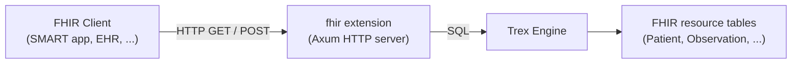

# fhir — FHIR Server

The `fhir` extension starts a FHIR R4–compliant HTTP server (built on Axum)
that serves healthcare resources from Trex storage. Clients see a standard
FHIR REST API; behind the scenes, every request resolves to SQL against
mirrored FHIR resource tables in the engine.

Use it when you have FHIR-shaped data (Patient / Observation / Encounter /
MedicationRequest etc.) ingested into Trex and want to expose it through the
spec-compliant FHIR HTTP surface — for clinical apps, SMART-on-FHIR
integrations, or quality measure execution.

## How it works



The FHIR server is an in-process HTTP server hosted by the engine, not a
separate container. Starting it is a SQL call:

```sql
SELECT trex_fhir_start('0.0.0.0', 8080);
```

After that, the server accepts standard FHIR R4 REST traffic at the configured
host/port — `GET /Patient/123`, `POST /Patient`, `GET /Observation?subject=Patient/123`,
search bundles, transaction bundles, `$everything` operations, etc.

## Resource storage

The server expects FHIR resources to live in a known schema with one table per
resource type (`Patient`, `Observation`, etc.). The schema follows the
HAPI-FHIR / SQL-on-FHIR conventions — see the integration tests
(`integration-tests/test_fhir_*.py`) for the table layout and ingestion paths.
Bulk import a FHIR Bundle JSON file via the bundle endpoint, or stream
individual `POST` requests; both append to the underlying tables.

## Pairing with quality measures

The FHIR server pairs naturally with the [cql2elm extension](cql2elm) for
running CQL-based quality measures: translate the CQL to ELM JSON, hand it to
the FHIR server's `$measure-evaluate` endpoint, and receive a `MeasureReport`.

## Functions

### `trex_fhir_start(host, port)`

Start the FHIR server bound to `host:port`. Multiple servers on different
ports can run concurrently (e.g. one for production, one for testing).

| Parameter | Type | Description |
|-----------|------|-------------|
| host | VARCHAR | Bind address. `0.0.0.0` to expose externally; `127.0.0.1` for local only. |
| port | INTEGER | TCP port. |

**Returns:** VARCHAR — status message.

```sql
SELECT trex_fhir_start('0.0.0.0', 8080);
-- Then in another terminal:
--   curl http://localhost:8080/metadata           -- CapabilityStatement
--   curl http://localhost:8080/Patient            -- Search all patients
--   curl http://localhost:8080/Patient/123        -- Read one patient
```

The server auto-loads the JSON and ICU DuckDB extensions on startup so it can
parse FHIR JSON and handle full-text/locale-aware queries.

### `trex_fhir_stop(host, port)`

Stop a running server. Identifies the server by bind address; you can stop a
specific port without disturbing others.

```sql
SELECT trex_fhir_stop('0.0.0.0', 8080);
```

### `trex_fhir_version()`

Return the extension's build version. Useful for compatibility checks.

```sql
SELECT trex_fhir_version();
```

### `trex_fhir_status()`

List every running FHIR server on this node.

**Returns:** TABLE

| Column | Description |
|--------|-------------|
| hostname | Bind address. |
| port | Listen port. |
| uptime_seconds | Seconds since start. |

```sql
SELECT * FROM trex_fhir_status();
```

## Operational notes

- **The server runs in the engine process.** Stopping the engine stops every
  FHIR server. Use the `db` extension's service-management functions
  (`trex_db_start_service`) when you want the FHIR server to be part of the
  cluster's managed service set.
- **TLS termination is upstream.** The extension does not currently terminate
  TLS — front it with a reverse proxy (nginx, Traefik, the `trexas` server's
  TLS port) for HTTPS.
- **Authentication is not built in.** The FHIR HTTP server does not check the
  Bearer token forwarded from the core auth layer. Place it behind an auth
  proxy if exposing externally, or restrict it to a private network.

## Next steps

- [SQL Reference → cql2elm](cql2elm) — translate Clinical Quality Language to
  ELM JSON for `$measure-evaluate`.
- [SQL Reference → atlas](atlas) — convert OHDSI cohort definitions to SQL
  (an alternative cohort-building path).
- The integration tests under `integration-tests/test_fhir_*.py` show
  end-to-end flows: bundle ingestion, search, measure evaluation.
