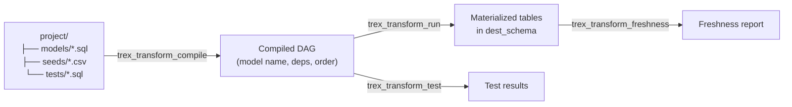

# transform — SQL Transformation Models

The `transform` extension implements a dbt-style workflow for SQL models,
seeds, tests, and freshness checks against Trex catalogs. If you've used dbt
or SQLMesh, the mental model is the same: SQL files declare derived datasets,
the runner figures out the dependency graph, and `run` materializes them in
topological order.

Use it when you want repeatable, version-controlled data transformations
inside Trex — without the overhead of running a separate dbt process. Pair
with the `transform` *plugin type* (see [Plugins → Transform
Plugins](../plugins/transform-plugins)) to expose model results as HTTP
endpoints automatically.

## How it works



A model is a SQL file in `models/`. It can reference other models with
`{{ ref('other_model') }}` (resolved at compile time), and source tables
with `{{ source('schema', 'table') }}`. Each model declares its
materialization (`view`, `table`, `incremental`, `ephemeral`) via a config
block at the top:

```sql
-- {{ config(materialized='table', endpoint_path='/orders') }}
SELECT
  o.order_id,
  o.customer_id,
  o.order_total,
  c.region
FROM {{ source('public', 'orders') }} o
LEFT JOIN {{ ref('stg_customers') }} c USING (customer_id)
```

## Project layout

The functions take a `project_path` pointing at a directory laid out like:

```
project/
├── models/
│   ├── staging/
│   │   └── stg_orders.sql
│   └── marts/
│       └── fact_orders.sql
├── seeds/
│   └── reference_data.csv
└── tests/
    └── orders_not_null.sql
```

These functions also back the `@trex/transform-plugins`
[plugin type](../plugins/transform-plugins) — a plugin's `project/` directory is
discovered automatically and its models are exposed as HTTP endpoints.

## Typical workflow

```sql
-- 1. Inspect the DAG without running anything
SELECT name, materialized, "order"
  FROM trex_transform_compile('/path/to/project')
 ORDER BY "order";

-- 2. Preview the next run
SELECT name, action, reason
  FROM trex_transform_plan(
    '/path/to/project',
    'analytics',   -- dest schema (where models materialize)
    'main'         -- source schema (where source() resolves)
  );

-- 3. Load seeds first (CSV → tables)
SELECT name, action, rows
  FROM trex_transform_seed('/path/to/project', 'analytics');

-- 4. Materialize models
SELECT name, action, duration_ms
  FROM trex_transform_run(
    '/path/to/project', 'analytics', 'main'
  );

-- 5. Run tests
SELECT name, status, rows_returned
  FROM trex_transform_test(
    '/path/to/project', 'analytics', 'main'
  );

-- 6. Watch freshness in production
SELECT name, status, age_hours
  FROM trex_transform_freshness('/path/to/project', 'analytics')
 WHERE status != 'ok';
```

The same six functions are exposed via GraphQL mutations / queries (see
[APIs → GraphQL](../apis/graphql)) so admin UIs and schedulers can drive
transforms without going through SQL directly.

## Materializations

| Materialization | What happens on run |
|-----------------|---------------------|
| `view` | `CREATE OR REPLACE VIEW dest.<name>` — query is executed on every read. |
| `table` | `CREATE OR REPLACE TABLE dest.<name> AS …` — full refresh on every run. |
| `incremental` | First run creates the table; subsequent runs `INSERT` only new rows based on a configured filter. |
| `ephemeral` | Inlined as a CTE in downstream models; never materialized. |

Default materialization is `view`. Override per model with the config block
at the top of the SQL file.

## Functions

### `trex_transform_compile(project_path)`

Parse and resolve every model in a project. Returns the dependency-ordered model
list without executing any SQL.

| Parameter | Type | Description |
|-----------|------|-------------|
| project_path | VARCHAR | Filesystem path to the project root. |

**Returns:** TABLE

| Column | Type | Description |
|--------|------|-------------|
| name | VARCHAR | Model name. |
| materialized | VARCHAR | `view`, `table`, `incremental`, or `ephemeral`. |
| order | INTEGER | Topological execution order. |
| status | VARCHAR | `ok` or an error message. |
| sql | VARCHAR | Compiled SQL (Jinja-rendered, `ref()` resolved). |
| references | VARCHAR | Comma-separated upstream model names. |
| endpoint_path | VARCHAR | If declared in the model config, the relative HTTP path under `/plugins/transform/<plugin>`. |
| endpoint_roles | VARCHAR | Comma-separated role list with access. |
| endpoint_formats | VARCHAR | Comma-separated allowed formats (`json`, `csv`, `arrow`). |

```sql
SELECT * FROM trex_transform_compile('/usr/src/plugins/@trex/analytics/project');
```

### `trex_transform_plan(project_path, dest_schema, source_schema)`

Diff what `trex_transform_run` would change against the destination schema's
current state. Useful as a dry-run.

| Parameter | Type | Description |
|-----------|------|-------------|
| project_path | VARCHAR | Project root. |
| dest_schema | VARCHAR | Schema where models are materialized. |
| source_schema | VARCHAR | Schema for `source()` references. |

**Returns:** TABLE

| Column | Type | Description |
|--------|------|-------------|
| name | VARCHAR | Model name. |
| action | VARCHAR | `create`, `replace`, `incremental`, `skip`. |
| materialized | VARCHAR | Materialization strategy. |
| reason | VARCHAR | Why this action was chosen. |

```sql
SELECT * FROM trex_transform_plan(
  '/usr/src/plugins/@trex/analytics/project',
  'analytics',
  'main'
);
```

### `trex_transform_run(project_path, dest_schema, source_schema)`

Execute every model in topological order against `dest_schema`.

| Parameter | Type | Description |
|-----------|------|-------------|
| project_path | VARCHAR | Project root. |
| dest_schema | VARCHAR | Destination schema (created if missing). |
| source_schema | VARCHAR | Schema for `source()` resolution. |

**Returns:** TABLE

| Column | Type | Description |
|--------|------|-------------|
| name | VARCHAR | Model name. |
| action | VARCHAR | What was done. |
| materialized | VARCHAR | Materialization strategy. |
| duration_ms | BIGINT | Wall-clock execution time. |
| message | VARCHAR | Status / error string. |

```sql
SELECT * FROM trex_transform_run(
  '/usr/src/plugins/@trex/analytics/project',
  'analytics',
  'main'
);
```

### `trex_transform_seed(project_path, dest_schema)`

Load every CSV under `seeds/` into `dest_schema` as a table. Existing tables
are dropped and recreated.

| Parameter | Type | Description |
|-----------|------|-------------|
| project_path | VARCHAR | Project root. |
| dest_schema | VARCHAR | Destination schema. |

**Returns:** TABLE

| Column | Type | Description |
|--------|------|-------------|
| name | VARCHAR | Seed name (filename without `.csv`). |
| action | VARCHAR | `created` or `replaced`. |
| rows | BIGINT | Rows inserted. |
| message | VARCHAR | Status / error string. |

### `trex_transform_test(project_path, dest_schema, source_schema)`

Run every `.sql` test under `tests/`. Tests are SQL queries that should return
zero rows; any returned rows are failures.

**Returns:** TABLE

| Column | Type | Description |
|--------|------|-------------|
| name | VARCHAR | Test name. |
| status | VARCHAR | `pass` or `fail`. |
| rows_returned | BIGINT | Rows returned by the test query (0 = pass). |

### `trex_transform_freshness(project_path, dest_schema)`

Check `loaded_at` columns on materialized models against per-model
`warn_after` / `error_after` thresholds declared in the model config.

**Returns:** TABLE

| Column | Type | Description |
|--------|------|-------------|
| name | VARCHAR | Model name. |
| status | VARCHAR | `ok`, `warn`, or `error`. |
| max_loaded_at | TIMESTAMP | Most recent row timestamp. |
| age_hours | DOUBLE | Hours since `max_loaded_at`. |
| warn_after | VARCHAR | Configured warning threshold. |
| error_after | VARCHAR | Configured error threshold. |

## Typical Workflow

```sql
-- Inspect models without running them
SELECT * FROM trex_transform_compile('/path/to/project');

-- Preview the next run
SELECT * FROM trex_transform_plan('/path/to/project', 'analytics', 'main');

-- Materialize seeds first, then models, then run tests
SELECT * FROM trex_transform_seed('/path/to/project', 'analytics');
SELECT * FROM trex_transform_run('/path/to/project', 'analytics', 'main');
SELECT * FROM trex_transform_test('/path/to/project', 'analytics', 'main');

-- Watch freshness in production
SELECT * FROM trex_transform_freshness('/path/to/project', 'analytics');
```
