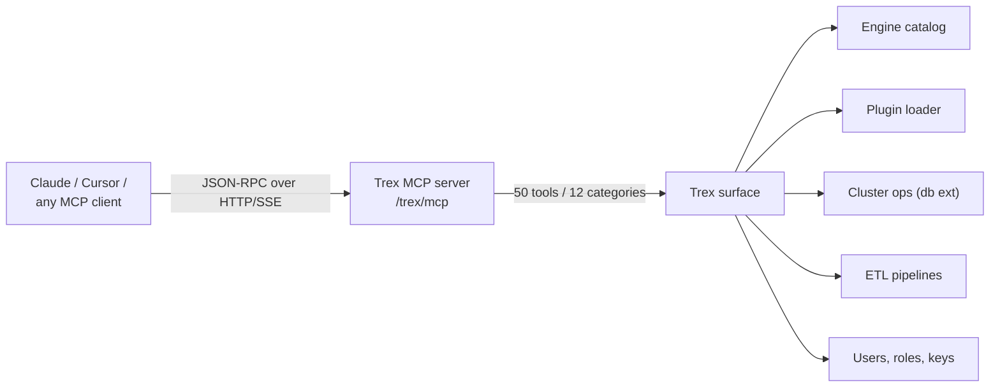

# Agentic Trex with MCP

This tutorial connects an AI agent (Claude Desktop, Cursor, or any MCP
client) to a Trex deployment and walks through a real workflow: schema
introspection, query exploration, plugin install, and cluster operations —
all driven by the agent picking from Trex's management tool catalog (50
tools across 12 categories).

The point: when ops surfaces are exposed as typed tools instead of buried
in a UI, an agent can do the same work a junior engineer would do
("describe this table, run a query against it, install the notebook
plugin, restart node-2") in one conversation.



Prerequisites: [Quickstart: Deploy](../quickstarts/deploy) running, plus an
MCP-capable AI client (we'll use Claude Desktop in examples; Cursor and
others work the same way).

## 1. Issue an API key (3 min)

The MCP surface authenticates with Bearer tokens — `trex_<48-hex>` (or
`sbp_…` legacy keys). Today every MCP-capable key is admin-equivalent —
there is no per-key scope mechanism. Keep keys to specific automation
contexts (one per agent, one per CI environment) and rotate them
aggressively. Per-tool scoping is on the roadmap; track it via the
project's GitHub issues.

If you have the admin UI wired up, go to **Settings → API Keys → Create**
and pick a descriptive name (e.g. `claude-desktop`). Otherwise, issue one
straight from a Bearer JWT for the seeded admin:

```bash
# Get an access token from the seeded admin
TOKEN=$(curl -s -X POST 'http://localhost:8001/trex/auth/v1/token?grant_type=password' \
  -H "Content-Type: application/json" \
  -d '{"email":"admin@trex.local","password":"password"}' | jq -r .access_token)

# Issue an MCP-compatible API key
TREX_KEY=$(curl -s -X POST http://localhost:8001/trex/api/api-keys \
  -H "Authorization: Bearer $TOKEN" \
  -H "Content-Type: application/json" \
  -d '{"name":"claude-mcp"}' | jq -r .key)

echo "$TREX_KEY"   # save this — it's only shown once
```

A note on audit: today, the only audit trail is the docker container's
stdout logs — pipe them to your central log store before relying on MCP
for compliance-bearing operations. (See §7 for the structured audit log
that's planned.)

Test the surface from the shell:

```bash
curl -X POST http://localhost:8001/trex/mcp \
  -H "Authorization: Bearer $TREX_KEY" \
  -H "Content-Type: application/json" \
  -d '{
    "jsonrpc": "2.0",
    "id": 1,
    "method": "tools/list",
    "params": {}
  }'
```

You'll get back the management tool catalog — 50 tools across 12
categories. That's the agent's vocabulary.

## 2. Wire up Claude Desktop (2 min)

### Auth model

> MCP authenticates with API-key tokens (`trex_…` or `sbp_…`), not JWT
> access tokens. The `Authorization: Bearer <token>` header must contain
> a key whose owning user has `role='admin'`. JWT access tokens from
> `/auth/v1/token` work on `/auth/v1/*` and `/api/*` admin endpoints but
> NOT on `/mcp`.

Edit Claude Desktop's config:

- **macOS**: `~/Library/Application Support/Claude/claude_desktop_config.json`
- **Windows**: `%APPDATA%\Claude\claude_desktop_config.json`
- **Linux**: `~/.config/Claude/claude_desktop_config.json`

```json
{
  "mcpServers": {
    "trex": {
      "url": "http://localhost:8001/trex/mcp",
      "headers": {
        "Authorization": "Bearer trex_2f8a1c..."
      }
    }
  }
}
```

Restart Claude Desktop. In a new conversation, you should see the 🔧 tool
indicator showing the Trex tools are available.

For Cursor, open Settings → MCP and add the same URL/headers. The protocol
is identical.

## 3. Schema introspection (5 min)

Start with the broadest sketch. In Claude:

> What databases, schemas, and tables are in this Trex deployment? Group by
> database, sort schemas alphabetically.

Claude will pick (in roughly this order):

- `trexdb-list-databases` — get the catalogs.
- `trexdb-list-schemas` — for each catalog.
- `trexdb-list-tables` — for each schema.

You'll get a hierarchical answer back. The agent figures out the order from
the tool descriptions; you don't tell it which to call.

Heads up: the filter arguments on the introspection tools (e.g.
`databaseName`, `schemaName` on `trexdb-list-tables`) are advisory in the
current build — the tool returns the full set regardless and the agent
introspects + filters client-side. Filtering is currently weak; expect
larger result payloads than the argument names suggest.

Drill in:

> How big is the `events` table in the `memory.main` schema? Break it down
> by `type`.

The agent calls `trexdb-list-tables` for size estimates, then
`trexdb-execute-sql` with a `SELECT type, COUNT(*) FROM ... GROUP BY type`
query. The result comes back inline in the chat.

## 4. Operate on the data (5 min)

Real "junior engineer" tasks now:

> The events table looks like it's growing fast. Let me see the partition
> layout, then propose a hash-partition by user_id with 4 partitions.

Claude calls `trexdb-execute-sql` to inspect `trex_db_partitions()`, sees
the table is unpartitioned, and asks for confirmation before running
`trex_db_partition_table`. (You can configure the agent to require
confirmation for destructive actions — both Claude and Cursor expose
this as a per-tool setting.)

Approve. The agent calls `trex_db_partition_table('memory.main.events',
'{...}')` via `trexdb-execute-sql` and reports back.

Other useful prompts at this stage:

- "Show me the slowest queries running right now and cancel any that are
  over 5 minutes old."
- "Which users haven't signed in for 90 days? Build me a list with their
  emails and last_sign_in_at."
- "Find tables with no primary key in the `analytics` schema."

## 5. Plugin operations (5 min)

The MCP surface includes `plugin-list`, `plugin-install`, `plugin-uninstall`,
`plugin-get-info`, and `plugin-function-invoke`. Try:

> Install the @trex/notebook plugin from the registry, then list what's
> installed.

The agent walks through:

1. `plugin-get-info` to see what versions exist.
2. `plugin-install` with the resolved version + the install directory.
3. `plugin-list` to confirm.

It will also flag the `pendingRestart: true` field in the result — Trex
plugins require a restart to load — and ask whether you want it to call
`cluster-stop-service` + `cluster-start-service` on `trexas` to roll the
HTTP server. (Don't do this in production unless you're prepared for a
brief HTTP outage.)

## 6. Cluster operations (5 min)

In a multi-node deployment ([Quickstart: Distributed Cluster](../quickstarts/distributed-cluster)),
the MCP surface covers cluster-level work:

> Show me cluster status, then drain node-2 so I can restart it.

Claude:

1. `cluster-list-nodes` and `cluster-get-status` for the overview.
2. `trexdb-execute-sql` with `SELECT trex_db_set('data_node', 'false')` *via
   the pgwire endpoint of node-2 specifically*. This is where it gets
   subtle — the MCP server is on one node, but the data-node setting needs
   to land on the target. The agent will typically ask you to confirm the
   target (or you give it the target hostname directly).
3. Polls `trexdb-execute-sql` with `SELECT * FROM trex_db_query_status()
   WHERE node = 'node-2'` until it shows zero in-flight queries.
4. Reports "node-2 drained — safe to stop".

## 7. The MCP audit trail

Every MCP tool call lands in the server's request log. For agent-driven
operations you'll want this in your central log store. The default
container logs to stdout — set up `docker logs --follow` capture or the
equivalent for your orchestrator.

A future Trex release will expose a structured audit log table
(`trex.mcp_audit`) with one row per tool call: caller key, tool name,
arguments, result, timestamp. Until then, request logs are the best
record.

## 8. Best practices

**Use one API key per agent/automation context.** Today every MCP-capable
key is admin-equivalent — there is no per-key scope mechanism. Don't share
your personal key with an agent. Issue a fresh key per agent / per CI
environment, name them descriptively (`claude-desktop-peter`,
`deploy-bot-staging`, etc.), and revoke aggressively when the use case
goes away or the key leaks. Per-tool scoping is on the roadmap.

**Confirm destructive actions.** Both Claude and Cursor have per-tool
"require confirmation" settings. Enable them for everything in the
`cluster-*`, `plugin-install`, `plugin-uninstall`, `database-delete`,
`user-ban`, `etl-stop-pipeline` set.

**Prompt the agent toward dry-runs.** Phrases like *"first show me what
this would do, then ask before applying"* steer the agent toward
`trex_transform_plan`, `EXPLAIN`, and similar inspection paths before
mutating anything.

**Watch token costs.** The management tool catalog (50 tools across 12
categories) plus their schemas adds up. For
agents on metered token costs, consider scoping the MCP surface — Trex
doesn't currently support per-key tool whitelists, but you can run a
proxy in front that filters.

## 9. What works well, what doesn't

**Works well:**

- Open-ended schema exploration ("what's in here?").
- Operational queries the agent has to compose ("find tables without PKs",
  "list users without recent activity").
- Walking through a multi-step procedure with confirmations
  (drain → restart → verify).
- Ad-hoc data-quality investigations (the agent runs sample queries, looks
  at the results, decides where to dig further).

**Less well:**

- Anything that needs sustained context. The agent forgets the layout of
  your tables between conversations.
- Performance-critical paths. The agent will happily issue an unbounded
  `SELECT *`. Use `trex_db_set_user_quota` and statement timeouts on the
  agent's role.
- Anything involving the file system or container layer. The MCP surface
  is the *server* — the agent can't `docker logs` for you.

## What you set up

A working agent → Trex pipeline:

- A scoped Bearer key.
- An MCP-aware client (Claude / Cursor) configured to call Trex.
- Comfort with the surface: schema introspection, query execution,
  plugin / cluster operations.
- Best practices around scoping, confirmation, and audit.

The same surface is what powers the admin UI under the hood. Anything you
can do in the dashboard, the agent can do via MCP — and frequently faster,
because it doesn't context-switch between menus.

## Next steps

- [APIs → MCP](../apis/mcp) for the full enumerated tool list.
- [Concepts → Auth Model](../concepts/auth-model) for how scoping and API
  keys interact with users and roles.
- [Tutorial: LLM-Augmented SQL](llm-augmented-sql) — the *other* direction:
  embedding LLM calls inside SQL rather than driving SQL from an LLM.
