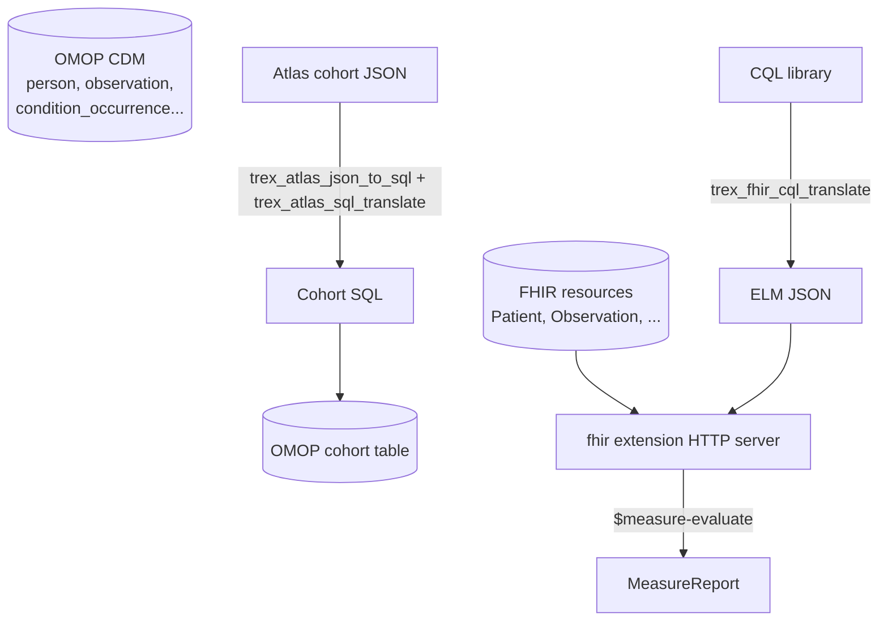

# Clinical Analytics — OMOP, Atlas, FHIR, CQL

This tutorial runs an end-to-end clinical-analytics workflow on Trex:
load OMOP CDM data, define a cohort in OHDSI Atlas, render it to SQL,
then evaluate a Clinical Quality Language (CQL) measure against
FHIR-converted patient resources.

By the end you'll have:

- An OMOP CDM populated with a sample dataset (Synthea or SynPUF).
- A cohort definition rendered to SQL via the `atlas` extension.
- The cohort materialised in the OMOP `cohort` results table.
- FHIR resources served by the `fhir` extension.
- A CQL library translated to ELM with `cql2elm`.
- A `MeasureReport` produced by the FHIR server's `$measure-evaluate`.



Prerequisites: [Quickstart: Deploy](../quickstarts/deploy) running and
basic familiarity with OMOP and FHIR. If you've never touched OHDSI tools,
read the [Atlas overview](https://www.ohdsi.org/atlas/) and [SQL-on-FHIR
intro](https://hl7.org/fhir/uv/sql-on-fhir/) first.

## 1. Set up an OMOP CDM (10 min)

The OHDSI ecosystem ships sample datasets. The two common choices:

- **[SynPUF](https://www.ohdsi.org/2018/02/26/cms-synpuf-data-sets/)**:
  CMS-generated synthetic Medicare claims. ~2.3M people. Free.
- **[Synthea](https://synthea.mitre.org/)**: synthetic EHR data. Generate
  any size. Free.

For this tutorial, use Synthea (it's small and the FHIR side comes for
free):

```bash
# In a working directory
git clone https://github.com/synthetichealth/synthea
cd synthea
./run_synthea -p 1000 \
  --exporter.csv.export true \
  --exporter.fhir.export true \
  --exporter.fhir.use_us_core_ig true
# Outputs to ./output/csv/ and ./output/fhir/
```

Convert the CSVs to OMOP CDM via the
[ETL-Synthea](https://github.com/OHDSI/ETL-Synthea) tool, or use a
pre-converted dataset. The CDM tables you'll need are `person`,
`observation_period`, `condition_occurrence`, `drug_exposure`,
`measurement`, `visit_occurrence`, `concept`.

Load into Trex:

```sql
CREATE SCHEMA cdm;

-- For each table, COPY from the CSV
COPY cdm.person     FROM '/data/synthea/cdm/person.csv'             (FORMAT CSV, HEADER);
COPY cdm.observation_period FROM '/data/synthea/cdm/observation_period.csv' (FORMAT CSV, HEADER);
COPY cdm.condition_occurrence FROM '/data/synthea/cdm/condition_occurrence.csv' (FORMAT CSV, HEADER);
-- ...etc
COPY cdm.concept    FROM '/data/synthea/cdm/concept.csv'            (FORMAT CSV, HEADER);

-- Sanity-check
SELECT COUNT(*) AS people FROM cdm.person;
SELECT COUNT(*) AS conditions FROM cdm.condition_occurrence;
```

Also create the OHDSI results schema where cohort rows will land:

```sql
CREATE SCHEMA results;

CREATE TABLE results.cohort (
  cohort_definition_id INT,
  subject_id           BIGINT,
  cohort_start_date    DATE,
  cohort_end_date      DATE
);
```

## 2. Define a cohort in Atlas (5 min)

In Atlas, create a cohort — for example: *"Patients aged 50-75 with type 2
diabetes diagnosis."* When you save it, Atlas exposes the JSON definition
under the cohort's *Export → Cohort definition* tab. Copy that JSON.

If you don't have an Atlas instance, use this minimal example
(simplified — substitute real concept IDs for production):

```json
{
  "ConceptSets": [
    {
      "id": 0,
      "name": "Type 2 diabetes",
      "expression": {
        "items": [{
          "concept": { "CONCEPT_ID": 201826, "CONCEPT_NAME": "Type 2 diabetes mellitus" },
          "isExcluded": false,
          "includeDescendants": true,
          "includeMapped": false
        }]
      }
    }
  ],
  "PrimaryCriteria": {
    "CriteriaList": [{
      "ConditionOccurrence": {
        "CodesetId": 0
      }
    }],
    "ObservationWindow": { "PriorDays": 0, "PostDays": 0 },
    "PrimaryCriteriaLimit": { "Type": "First" }
  },
  "QualifiedLimit": { "Type": "First" },
  "ExpressionLimit": { "Type": "First" },
  "InclusionRules": [{
    "name": "Aged 50-75",
    "expression": {
      "Type": "ALL",
      "CriteriaList": [],
      "DemographicCriteriaList": [{
        "Age": { "Value": 50, "Op": "gte" }
      }, {
        "Age": { "Value": 75, "Op": "lte" }
      }],
      "Groups": []
    }
  }],
  "EndStrategy": { "DateOffset": { "DateField": "StartDate", "Offset": 0 } },
  "CensoringCriteria": [],
  "CollapseSettings": { "CollapseType": "ERA", "EraPad": 0 },
  "CensorWindow": {}
}
```

Save it as `/data/cohort.json`.

## 3. Render and execute the cohort (5 min)

The `atlas` extension converts the JSON to SQL annotated for SqlRender,
then translates to a target dialect. There are two important things to
know up front:

1. `trex_atlas_json_to_sql` requires the cohort JSON to be **base64-encoded**
   before it crosses the function boundary. Encode it client-side, or wrap
   the file read in `encode(...::bytea, 'base64')`.
2. The render-options object uses **camelCase** keys: `cdmSchema`,
   `vocabularySchema`, `resultSchema`, `targetTable`, `cohortId`,
   `generateStats`. (Don't be misled by the snake_case form some Atlas
   exports use internally.)

The correct pipeline is `json_to_sql` (cohort JSON → annotated SqlRender
SQL) → `sql_translate` (annotated SQL → dialect-specific SQL).
`trex_atlas_sql_render_translate` is a separate SqlRender helper for
already-annotated templates and does *not* take a cohort JSON.

```sql
-- Read the JSON, base64-encode it, render to annotated SQL, translate
-- to PostgreSQL — all in one pass.
CREATE TEMP TABLE _cohort AS
  SELECT trex_atlas_sql_translate(
    trex_atlas_json_to_sql(
      encode(cohort_def::bytea, 'base64'),
      '{
        "cdmSchema": "cdm",
        "vocabularySchema": "cdm",
        "resultSchema": "results",
        "targetTable": "cohort",
        "cohortId": 1,
        "generateStats": false
      }'
    ),
    'postgresql'
  ) AS sql_text
  FROM (SELECT readfile('/data/cohort.json') AS cohort_def) t;

-- Execute the rendered SQL.
-- (Trex's SQL is close enough to PostgreSQL that the postgresql dialect
-- works for most cohort definitions.)
SELECT * FROM _cohort \gexec
```

If you'd rather pre-encode the cohort JSON outside the database
(`base64 -w0 /data/cohort.json`), pass that base64 string straight into
`trex_atlas_json_to_sql` and skip the `encode(...)` call.

If your psql doesn't support `\gexec` (e.g. via JDBC), pull the SQL out
and submit it as a separate batch. The result: rows in `results.cohort`
with `cohort_definition_id = 1` and one entry per matching person.

Verify:

```sql
SELECT COUNT(DISTINCT subject_id) AS cohort_size
  FROM results.cohort
 WHERE cohort_definition_id = 1;

SELECT subject_id, cohort_start_date, cohort_end_date
  FROM results.cohort
 WHERE cohort_definition_id = 1
 LIMIT 10;
```

## 4. Bring in FHIR resources (5 min)

Synthea exported FHIR R4 bundles to `./output/fhir/`. Start the FHIR
server and load the bundles:

```sql
SELECT trex_fhir_start('0.0.0.0', 8080);
SELECT * FROM trex_fhir_status();
```

> **Port 8080 is not published by the default `docker-compose.yml`.**
> Either run curl from inside the container, e.g.
> `docker exec trexsql-trex-1 curl http://localhost:8080/health`, or
> add a `- "8080:8080"` mapping to the `trex` service in compose and
> restart. The rest of this section assumes you've done one or the
> other.

FHIR routes are scoped under a **dataset id** — `/{dataset_id}/...` —
not flat at `/`. Before posting bundles, create a dataset:

```bash
curl -X POST http://localhost:8080/datasets \
  -H 'Content-Type: application/json' \
  -d '{"id":"synthea","name":"Synthea Test"}'

# List datasets
curl http://localhost:8080/datasets

# CapabilityStatement for the dataset
curl http://localhost:8080/synthea/metadata
```

Then post each bundle into the `synthea` dataset:

```bash
for f in output/fhir/*.json; do
  curl -X POST http://localhost:8080/synthea/ \
    -H "Content-Type: application/fhir+json" \
    -d @"$f"
done
```

The server parses each bundle and inserts the contained resources into the
backing FHIR resource tables. Verify:

```bash
curl -s 'http://localhost:8080/synthea/Patient?_count=1' | jq '.total'
curl -s 'http://localhost:8080/synthea/Observation?_count=1' | jq '.total'
```

## 5. Define a CQL measure (5 min)

A simple HEDIS-style measure: *"Diabetic patients with HbA1c measured in
the last year."* Save as `/data/diabetes_a1c.cql`:

```cql
library DiabetesA1c version '1.0.0'

using FHIR version '4.0.1'

include FHIRHelpers version '4.0.1' called FHIRHelpers

context Patient

define "InMeasurePopulation":
  exists [Condition: code in "Diabetes"]

define "InNumerator":
  exists (
    [Observation: code in "HbA1c"] O
      where O.effective during Interval[Now() - 1 year, Now()]
  )

valueset "Diabetes": 'http://example.org/fhir/ValueSet/diabetes'
valueset "HbA1c":    'http://example.org/fhir/ValueSet/hba1c'
```

(Real measures pull from VSAC value sets; for a tutorial we keep them
abstract.)

## 6. Translate CQL to ELM (2 min)

```sql
SELECT trex_fhir_cql_translate(
  readfile('/data/diabetes_a1c.cql')
) AS elm_json;
```

Save the resulting ELM JSON — that's what the FHIR server consumes when
evaluating the measure.

In a real pipeline you'd persist this:

```sql
CREATE TABLE measures (
  measure_id   TEXT PRIMARY KEY,
  cql_source   TEXT,
  elm_json     TEXT,
  updated_at   TIMESTAMPTZ
);

INSERT INTO measures
SELECT
  'DiabetesA1c',
  cql.txt,
  trex_fhir_cql_translate(cql.txt),
  NOW()
FROM (SELECT readfile('/data/diabetes_a1c.cql') AS txt) cql;
```

## 7. Evaluate the measure (3 min)

The FHIR server exposes `$measure-evaluate`. Hand it the ELM JSON plus the
population window:

```bash
ELM=$(psql -h localhost -p 5433 -U trex -d main -t -A \
  -c "SELECT elm_json FROM measures WHERE measure_id = 'DiabetesA1c'")

curl -X POST 'http://localhost:8080/synthea/Measure/DiabetesA1c/$evaluate-measure?periodStart=2025-01-01&periodEnd=2025-12-31' \
  -H "Content-Type: application/fhir+json" \
  -d "$(jq -n --argjson elm "$ELM" '{
    "resourceType": "Parameters",
    "parameter": [{
      "name": "elm",
      "valueString": ($elm | tostring)
    }]
  }')"
```

The response is a `MeasureReport` resource:

```json
{
  "resourceType": "MeasureReport",
  "status": "complete",
  "type": "summary",
  "measure": "DiabetesA1c",
  "period": {
    "start": "2025-01-01",
    "end": "2025-12-31"
  },
  "group": [{
    "population": [
      { "code": { "coding": [{ "code": "initial-population" }] }, "count": 1234 },
      { "code": { "coding": [{ "code": "denominator" }] },        "count": 1234 },
      { "code": { "coding": [{ "code": "numerator" }] },          "count":  812 }
    ],
    "measureScore": { "value": 0.658 }
  }]
}
```

That's the score: 65.8% of diabetic patients had an HbA1c in the window.

## 8. Bringing it together

You now have two complementary layers:

- **OMOP / Atlas / SQL** for analytical cohort definitions — where you
  want to count people, compute incidence rates, run characterisations.
- **FHIR / CQL / ELM** for clinical-quality measure execution — where the
  spec lives in healthcare interop terms (HEDIS, CMS, eCQI).

Both run inside the same Trex container. The OMOP side speaks SQL; the
FHIR side speaks REST. Same engine, same auth, same deployment.

A practical pipeline:

1. Define cohort in Atlas → render via `atlas` → materialise in OMOP
   results.
2. Pull cohort patients out as FHIR via the FHIR server's `$everything`
   operation.
3. Run measure evaluation on those patients with `cql2elm` + FHIR.
4. Persist `MeasureReport`s back into OMOP for longitudinal analysis.

## Operational notes

- **Version pinning matters.** Atlas cohort JSON encodes vocabulary
  concept IDs; CQL libraries reference value-set OIDs. Pin both to a
  stable vocabulary release; record the pinning in the measure metadata.
- **Concept set drift.** When OHDSI publishes a new vocabulary, your
  rendered cohort SQL may pick up new descendants of a parent concept.
  Re-render and diff before re-running.
- **Memory.** A full Synthea / SynPUF load can be 10s-100s of GB. Use
  `DATABASE_PATH=/data/trex.db` (persistent on-disk catalog) instead of
  the default `:memory:`.
- **Authorization.** The FHIR server doesn't enforce per-resource
  authorization out of the box. Front it with the auth proxy
  (`apis/auth`) or restrict it to a private network.
- **Reproducibility.** Save the cohort JSON, the CQL source, the ELM JSON,
  and the vocabulary version together. That tuple is your reproducible
  measure run; missing any one of them, you can't reconstruct the result.
- **Stability.** Several Atlas / FHIR calls have been observed to crash
  the trex process in the current image — particularly
  `trex_atlas_json_to_sql` with malformed input and `trex_fhir_start` on
  a port that's already bound. Wrap calls in a retry loop and check
  `docker compose ps` if a session goes silent.

## What you built

A complete clinical-analytics pipeline:

- An OMOP CDM populated with synthetic patient data.
- A cohort defined in Atlas, rendered to SQL, and materialised.
- A FHIR server backed by the same data, ingesting bundles.
- A CQL library translated to ELM and evaluated against the FHIR
  resources.
- A `MeasureReport` summarising the result.

There is no separate Atlas WebAPI server, no separate FHIR backend, no
separate CQL engine. Three OHDSI / HL7 standards, one Trex container.

## Next steps

- [SQL Reference → atlas](../sql-reference/atlas) for cohort-rendering
  options across SQL dialects.
- [SQL Reference → fhir](../sql-reference/fhir) for the FHIR server's
  HTTP surface.
- [SQL Reference → cql2elm](../sql-reference/cql2elm) for translation
  details.
- The `integration-tests/test_fhir_cql*.py` files in the repo are working
  reference flows.
