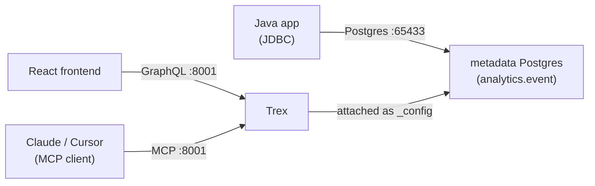

# Embed Trex in your stack

This tutorial walks through three integration paths against the same Trex
deployment, in one sitting:

1. **pgwire from a Java app** — analytical batch queries via JDBC.
2. **GraphQL from a React frontend** — typed, interactive reads.
3. **MCP from an AI agent** — schema introspection and ad-hoc queries.

The point is breadth: Trex deliberately speaks the protocols your existing
toolchains already use, so embedding it usually doesn't mean learning a new
client. By the end you'll have all three clients hitting the same shared
table.

Prerequisites: [Quickstart: Deploy](../quickstarts/deploy) running on
`localhost:8001`.



:::caution Pgwire's `memory` catalog is per-session
Trex's default pgwire catalog (`memory`) is in-process and ephemeral: a
table created in one psql session is invisible to subsequent sessions and
to other protocols (GraphQL, MCP). To share data across protocols, persist
it in the metadata Postgres (as we do below) or attach a persistent Trex
catalog via `DATABASE_PATH`.
:::

## 1. Seed shared data

We'll create the canonical `analytics.event` table in the **metadata
Postgres** (port `65433`). This is the storage backing Trex's internal
state, and it's reachable by every protocol:

- GraphQL via PostGraphile (which reads metadata PG directly).
- MCP / pgwire via Trex's attached `_config` catalog (metadata PG is
  attached as the `_config` catalog inside Trex).
- JDBC via a direct Postgres connection on port `65433`.

Connect to the metadata Postgres:

```bash
psql -h localhost -p 65433 -U postgres -d testdb
```

```sql
CREATE SCHEMA IF NOT EXISTS analytics;

CREATE TABLE analytics.event (
  id        INTEGER PRIMARY KEY,
  user_id   INTEGER,
  type      TEXT,
  amount    NUMERIC(10,2),
  ts        TIMESTAMP
);

INSERT INTO analytics.event
SELECT
  i,
  i % 100,
  CASE i % 3 WHEN 0 THEN 'click' WHEN 1 THEN 'purchase' ELSE 'view' END,
  (random() * 100)::NUMERIC(10,2),
  NOW() - (i || ' minutes')::INTERVAL
FROM generate_series(1, 10000) t(i);

SELECT type, COUNT(*) FROM analytics.event GROUP BY type;
```

You should see ~3,333 rows per type, totalling 10,000.

Next, expose the `analytics` schema to PostGraphile. Add a `PG_SCHEMA`
line under `trex.environment` in `docker-compose.yml` (it isn't there by
default):

```yaml
# docker-compose.yml
services:
  trex:
    environment:
      PG_SCHEMA: trex,analytics
```

Then bring Trex back up so the new env var takes effect:

```bash
docker compose up -d trex
```

## 2. JDBC from Java (5 min)

For shared, persistent reads across sessions, point JDBC at the metadata
Postgres on port `65433` — the same database where we created
`analytics.event`. The standard
[pgJDBC](https://jdbc.postgresql.org/) driver works without modification.

(Trex's pgwire endpoint on port `5433` is great for ad-hoc analytics over
attached catalogs, but its default `memory` catalog is per-session and
won't see the table we just created. See the caveat above.)

```java
// build.gradle: implementation 'org.postgresql:postgresql:42.7.3'
import java.sql.*;

public class TrexQuery {
  public static void main(String[] args) throws SQLException {
    String url = "jdbc:postgresql://localhost:65433/testdb";

    try (Connection conn = DriverManager.getConnection(url, "postgres", "mypass");
         PreparedStatement ps = conn.prepareStatement(
             "SELECT type, COUNT(*) AS n, AVG(amount) AS avg_amt " +
             "  FROM analytics.event " +
             " WHERE ts >= NOW() - INTERVAL '1 hour' " +
             " GROUP BY type " +
             " ORDER BY n DESC")) {
      try (ResultSet rs = ps.executeQuery()) {
        while (rs.next()) {
          System.out.printf("%s: %d events, avg %.2f%n",
              rs.getString("type"),
              rs.getInt("n"),
              rs.getBigDecimal("avg_amt"));
        }
      }
    }
  }
}
```

Run it. You'll see the type distribution from the last hour.

JDBC is the right path when:

- You're integrating with an existing JVM stack (Spark, Flink, JDBC-flavoured
  BI tools).
- Your queries are heavy and you want streaming row sets.
- You want bind parameters (auto-pinning kicks in — see [Concepts →
  Connection Pool](../concepts/connection-pool#sessions-and-pinning)).

It's not the right path when you're building a browser-side feature
(JDBC doesn't run in browsers) — use GraphQL for that.

## 3. GraphQL from a React frontend (10 min)

PostGraphile auto-generates GraphQL from the `analytics.event` table. The
admin UI's GraphiQL (set `ENABLE_GRAPHIQL=true`) shows you the schema; from
a React app, any GraphQL client works. Below uses raw `fetch`:

```typescript
// frontend/src/api.ts
const TREX = "http://localhost:8001/trex";

async function loginPassword(email: string, password: string) {
  const res = await fetch(`${TREX}/auth/v1/token?grant_type=password`, {
    method: "POST",
    headers: { "Content-Type": "application/json" },
    body: JSON.stringify({ email, password }),
  });
  if (!res.ok) throw new Error(await res.text());
  return res.json();   // { access_token, refresh_token, user }
}

async function recentEventsByType(token: string) {
  const res = await fetch(`${TREX}/graphql`, {
    method: "POST",
    headers: {
      "Authorization": `Bearer ${token}`,
      "Content-Type": "application/json",
    },
    body: JSON.stringify({
      query: `
        query EventsByType {
          allAnalyticsEvents(first: 100) {
            nodes { rowId type amount ts }
          }
        }`,
    }),
  });
  const { data, errors } = await res.json();
  if (errors) throw new Error(errors[0].message);
  // PostGraphile's AnalyticsEventOrderBy only supports per-PK ordering, so
  // sort client-side by ts.
  return data.allAnalyticsEvents.nodes
    .slice()
    .sort((a: any, b: any) => +new Date(b.ts) - +new Date(a.ts));
}
```

A minimal React component consuming it:

```tsx
import { useEffect, useState } from "react";
import { loginPassword, recentEventsByType } from "./api";

export function EventList() {
  const [events, setEvents] = useState<any[]>([]);

  useEffect(() => {
    (async () => {
      const { access_token } = await loginPassword(
        import.meta.env.VITE_DEMO_EMAIL,
        import.meta.env.VITE_DEMO_PASSWORD,
      );
      setEvents(await recentEventsByType(access_token));
    })();
  }, []);

  return (
    <table>
      <thead><tr><th>Type</th><th>Amount</th><th>When</th></tr></thead>
      <tbody>
        {events.map(e => (
          <tr key={e.rowId}>
            <td>{e.type}</td>
            <td>${e.amount}</td>
            <td>{new Date(e.ts).toLocaleString()}</td>
          </tr>
        ))}
      </tbody>
    </table>
  );
}
```

GraphQL is the right path when:

- Your client is a browser or a mobile app (no JDBC available).
- You want a single typed schema covering many tables.
- Pagination, ordering, and filtering should be declarative, not bespoke.

Use [`@supabase/supabase-js`](https://supabase.com/docs/reference/javascript)
or any Apollo / urql / Relay client if you want a richer JS client — Trex's
GraphQL surface is wire-compatible with PostGraphile.

## 4. MCP from an AI agent (5 min)

The MCP server exposes the Trex management tool catalog (~50 tools) —
including schema introspection and arbitrary SQL execution — to AI
clients. Configure Claude Desktop:

`~/Library/Application Support/Claude/claude_desktop_config.json` (macOS) or
the equivalent on your platform:

```json
{
  "mcpServers": {
    "trex": {
      "url": "http://localhost:8001/trex/mcp",
      "headers": {
        "Authorization": "Bearer trex_<48-hex>"
      }
    }
  }
}
```

Issue an admin API key. The fastest path is the web UI (Settings → API
Keys), but for scripts you can do it via curl. The seeded admin
(`admin@trex.local` / `password`) ships with every Trex deployment —
self-signup is disabled by default, so use that account:

```bash
TOKEN=$(curl -s -X POST 'http://localhost:8001/trex/auth/v1/token?grant_type=password' \
  -H "Content-Type: application/json" \
  -d '{"email":"admin@trex.local","password":"password"}' | jq -r .access_token)

TREX_KEY=$(curl -s -X POST http://localhost:8001/trex/api/api-keys \
  -H "Authorization: Bearer $TOKEN" \
  -H "Content-Type: application/json" \
  -d '{"name":"embed-tutorial-key"}' | jq -r .key)
```

Plug `$TREX_KEY` into the `Authorization: Bearer …` header above (the MCP
server accepts the API key directly — no JWT exchange needed for tool
calls).

Restart Claude Desktop. In a new conversation:

> What tables exist under `_config.analytics` in Trex, and roughly how big
> is each?

Claude will pick `trexdb-list-tables`, scope to the `_config` catalog and
`analytics` schema, and produce a size summary. Try a follow-up:

> Using `_config.analytics.event`, show me the top 10 users by total
> purchase amount in the last 24 hours.

It'll compose a SQL query against `_config.analytics.event`, hand it to
`trexdb-execute-sql`, and present the result.

For more on the MCP surface and an agentic workflow, see [Tutorial: Agentic
Trex with MCP](agentic-trex-with-mcp).

MCP is the right path when:

- The "client" is an AI agent doing operations rather than a fixed UI.
- The query shape is unknown ahead of time and the agent should decide.
- You want one auth surface (the same `trex_…` token works for everything).

## 5. Pick the right path

| When you have… | Use |
|----------------|-----|
| A JVM batch job pulling rollups | pgwire / JDBC |
| A python notebook for ad-hoc analysis | pgwire (psycopg) or `trexdb-execute-sql` via MCP |
| A typed browser frontend | GraphQL |
| A REST-shaped client (mobile, IoT) | The PostgREST proxy at `/rest/v1/*` |
| An AI assistant that should "do things" | MCP |
| Inter-service calls within a Trex deployment | Plugin functions ([Plugins → Function Plugins](../plugins/function-plugins)) |

All five paths share one auth model — the same JWT or `trex_…` API key
works across the lot. See [Concepts → Auth Model](../concepts/auth-model).

## What you built

Three independent clients reading the same dataset:

- A Java console app over JDBC for analytical batch.
- A React component over GraphQL for typed interactive reads.
- An AI agent over MCP for schema-aware ad-hoc work.

Trex didn't change between them — only the protocol did.

## Next steps

- [Tutorial: Multi-Source Analytics](multi-source-analytics) to extend the
  data side beyond a single table.
- [Tutorial: Agentic Trex with MCP](agentic-trex-with-mcp) for the AI-agent
  path in depth.
- [APIs](../apis/graphql) for protocol-by-protocol references.
