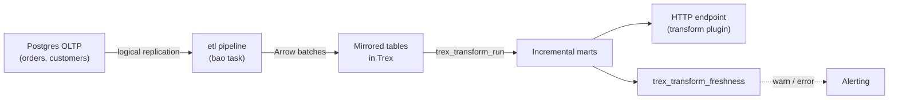

# Incremental Data Warehouse

This tutorial builds an incremental data warehouse: continuously replicate a
Postgres OLTP database into Trex via the `etl` extension, model the data
with `transform`, and detect staleness with freshness checks. The result is
a self-maintaining warehouse — new rows in OLTP show up in derived models
within seconds, with no scheduled batch job.

By the end you'll have:

- A Postgres source with a publication for logical replication.
- A `cdc` pipeline streaming changes into Trex.
- An incremental transform model that picks up only new rows on each run.
- A scheduled run that refreshes downstream marts.
- Freshness alerts when ingestion stalls.



Prerequisites: [Quickstart: Deploy](../quickstarts/deploy) running, plus a
reachable Postgres with `wal_level = logical`.

> **Auth note:** pgwire on the default `latest` image starts without
> authentication (`pgwire starting without authentication` appears in the
> startup logs), so `psql -U trex` connects with no password. Production
> deployments should configure pgwire credentials before exposing the port.

## 1. Prepare the source Postgres (5 min)

The source needs three things: logical WAL, a replication-privileged role,
and a publication declaring the tables.

```sql
-- One-time setup on the source DB
ALTER SYSTEM SET wal_level = 'logical';
-- ⚠ requires Postgres restart

CREATE ROLE trex_repl WITH REPLICATION LOGIN PASSWORD 's3cret';
GRANT USAGE ON SCHEMA public TO trex_repl;
GRANT SELECT ON ALL TABLES IN SCHEMA public TO trex_repl;
ALTER DEFAULT PRIVILEGES IN SCHEMA public
  GRANT SELECT ON TABLES TO trex_repl;

CREATE PUBLICATION trex_pub FOR TABLE
  public.customers,
  public.orders,
  public.order_items;
```

Verify:

```sql
SELECT pubname, schemaname, tablename
  FROM pg_publication_tables WHERE pubname = 'trex_pub';
```

Seed some data if the tables are empty — you'll want enough rows to see
the pipeline running.

## 2. Start the CDC pipeline in Trex (3 min)

From a Trex pgwire session (`psql -h localhost -p 5433 -U trex -d main`):

```sql
SELECT trex_etl_start(
  'oltp_pipeline',
  'host=source-db port=5432 user=trex_repl password=s3cret dbname=app publication=trex_pub',
  'copy_and_cdc',
  1000,    -- batch size
  5000,    -- batch timeout (ms)
  3000,    -- retry delay (ms)
  5        -- max retries
);
```

The `etl` extension parses connection strings in libpq `key=value` form
only — URI form (`postgres://...`) is not supported. The publication name
travels in the same string as `publication=trex_pub`, not as a separate
argument.

> **Known issue:** the current `latest` image's `etl` extension panics on
> every replication-mode call (`copy_only`, `cdc_only`, and `copy_and_cdc`)
> — the rustls crate's CryptoProvider isn't installed at extension boot, so
> the first TLS handshake aborts and takes the trex process with it.
> Symptom: `failed to bootstrap rustls CryptoProvider` in the container
> logs, and the pgwire connection drops mid-call. A fix is in progress;
> track via the etl extension issues. Until then, the CDC path in this
> tutorial cannot be exercised against the published image.

The valid replication modes:

| Mode          | What it does                                      | When to use |
| ------------- | ------------------------------------------------- | ----------- |
| `copy_and_cdc`| Bulk-copy then switch to streaming WAL.           | Default for production. |
| `cdc_only`    | Tail the replication slot from current LSN.       | When you bootstrap data separately. |
| `copy_only`   | One-shot bulk copy, then stop.                    | Dev/test, one-time loads. |

`copy_and_cdc` does a one-shot bulk-copy of every table in the
publication, then switches to streaming WAL changes. There is no gap
between the two phases — the pipeline coordinates the snapshot LSN with
the start of replication.

Watch progress:

```sql
SELECT name, state, rows_replicated, last_activity, error
  FROM trex_etl_status();
```

After ~30 seconds you should see `state = running` with `rows_replicated`
climbing. The `error` column is `NULL` while healthy and carries the last
failure message otherwise. Verify the data landed:

```sql
SELECT COUNT(*) FROM customers;            -- works only if search_path includes public
SELECT COUNT(*) FROM memory.public.customers;
SELECT COUNT(*) FROM memory.public.orders;
```

The replicated tables live in the connection's default catalog (`memory`
in the default compose, or whatever `DATABASE_PATH` points at) under the
source schema name — logical replication preserves `public`, so the fully
qualified path is `memory.public.<table>`. Each column type maps from
Postgres to its Arrow equivalent automatically.

## 3. Define an incremental transform model (10 min)

A full table refresh on every run is wasteful when most rows haven't
changed. The `transform` extension supports incremental materialisation:
the first run populates the table; subsequent runs only insert / merge
rows that are new.

Create a transform plugin:

```bash
mkdir -p plugins-dev/@trex/sales-warehouse/project/{models,tests}
```

`plugins-dev/@trex/sales-warehouse/package.json`:

```json
{
  "name": "@trex/sales-warehouse",
  "version": "0.1.0",
  "trex": {
    "transform": {}
  }
}
```

`plugins-dev/@trex/sales-warehouse/project/project.yml` lists the source
tables the project reads from:

```yaml
# plugins-dev/@trex/sales-warehouse/project/project.yml
name: sales_warehouse
source_tables: [orders, customers, order_items]
```

`plugins-dev/@trex/sales-warehouse/project/models/fct_orders.sql`:

```sql
SELECT
  o.order_id,
  o.customer_id,
  c.email                            AS customer_email,
  c.region_code,
  o.status,
  o.amount,
  o.created_at,
  o.updated_at
FROM orders o
JOIN customers c USING (customer_id)
-- __is_incremental__
WHERE o.updated_at > (SELECT MAX(updated_at) FROM __this__)
-- __end_incremental__
```

The transform extension does **not** evaluate dbt-style Jinja
(`{{ source(...) }}`, `{{ ref(...) }}`, `{{ this }}`,
``). Use bare table names — the runner resolves
them against the configured source schema — or fully-qualified
cross-database references like `pg.public.orders`. The
`__is_incremental__` / `__end_incremental__` markers are the supported
mechanism for the "rows updated since the last high-water mark" filter.

Model configuration lives in a sibling YAML file, not a comment block at
the top of the SQL (those are silently ignored).

`plugins-dev/@trex/sales-warehouse/project/models/fct_orders.yml`:

```yaml
materialized: incremental
unique_key: order_id
incremental_strategy: append
loaded_at_field: created_at
warn_after: 10 minutes
error_after: 1 hour
endpoint_path: /orders
```

`incremental_strategy: append` is **critical** — the default
`delete_insert` (and `merge`) strategies skip runs whose model checksum is
unchanged, which would defeat the auto-pickup demo in Section 6.

Add a downstream rollup that depends on `fct_orders`:

`plugins-dev/@trex/sales-warehouse/project/models/agg_daily_revenue.sql`:

```sql
SELECT
  region_code,
  DATE_TRUNC('day', created_at) AS day,
  COUNT(*)                       AS orders,
  SUM(amount)                    AS revenue
FROM fct_orders
GROUP BY region_code, day
```

`plugins-dev/@trex/sales-warehouse/project/models/agg_daily_revenue.yml`:

```yaml
materialized: table
loaded_at_field: day
warn_after: 30 minutes
error_after: 2 hours
endpoint_path: /daily-revenue
```

Add a test:

`plugins-dev/@trex/sales-warehouse/project/tests/orders_have_customers.sql`:

```sql
SELECT order_id
  FROM fct_orders
 WHERE customer_email IS NULL
```

Tests pass when they return zero rows.

Restart Trex so the plugin is loaded:

```bash
docker compose restart trex
```

## 4. First run — bulk build (3 min)

`trex_transform_run` (and `trex_transform_plan`) take the project path and
destination schema as positional arguments; `source_schema` is named-only.

```sql
-- See what will run
SELECT name, action, reason
  FROM trex_transform_plan(
    '/usr/src/plugins-dev/@trex/sales-warehouse/project',
    'warehouse',
    source_schema => 'public'
  );

-- Build everything
SELECT name, action, materialized, duration_ms
  FROM trex_transform_run(
    '/usr/src/plugins-dev/@trex/sales-warehouse/project',
    'warehouse',
    source_schema => 'public'
  );

-- Verify data
SELECT COUNT(*) FROM warehouse.fct_orders;
SELECT * FROM warehouse.agg_daily_revenue ORDER BY day DESC LIMIT 5;

-- Run tests
SELECT name, status, rows_returned
  FROM trex_transform_test(
    '/usr/src/plugins-dev/@trex/sales-warehouse/project',
    'warehouse',
    source_schema => 'public'
  );
```

## 5. Schedule the incremental refresh (5 min)

The CDC pipeline keeps the source-mirrored tables (`public.orders`,
`public.customers`) up to date in seconds. To propagate changes into the
marts, schedule periodic `transformRun` calls.

Two options:

### Option A: cron-style host job

```bash
# /etc/cron.d/trex-warehouse — every 5 minutes
*/5 * * * * curl -s -X POST http://localhost:8001/trex/graphql \
  -H "Authorization: Bearer $TREX_TOKEN" \
  -H "Content-Type: application/json" \
  -d '{"query":"mutation { transformRun(pluginName: \"sales-warehouse\", destDb: \"memory\", destSchema: \"warehouse\", sourceDb: \"memory\", sourceSchema: \"public\") { name action durationMs } }"}' \
  > /var/log/trex-warehouse.log
```

> **Known issue:** if the GraphQL mutation fails with a `Table does not
> exist` error, the resolver is concatenating `sourceDb.sourceSchema`
> incorrectly — fix in progress. The SQL alternative is reliable today:
> `SELECT * FROM trex_transform_run('/path/to/project', 'warehouse', source_schema => 'public');`

### Option B: a flow plugin (Prefect)

If you already run Prefect, declare the refresh as a flow plugin
deployment so it's managed alongside other workflows. See
[Plugins → Flow Plugins](../plugins/flow-plugins).

Either way, the incremental model means each run only touches recently-
updated rows — the runtime stays bounded as the table grows.

## 6. Verify incremental behaviour

Insert a fresh row in the source Postgres:

```sql
-- On the source
INSERT INTO orders (order_id, customer_id, amount, status, created_at, updated_at)
VALUES (999999, 42, 12.34, 'placed', NOW(), NOW());
```

Within a few seconds, the `etl` pipeline replicates it. On the next
`transform_run`:

```sql
SELECT name, action, materialized, duration_ms
  FROM trex_transform_run(
    '/usr/src/plugins-dev/@trex/sales-warehouse/project',
    'warehouse',
    source_schema => 'public'
  );
-- fct_orders: action=incremental, processes only the new row → fast
-- agg_daily_revenue: action=replace, full rebuild
```

> **Strategy caveat:** the auto-pickup behaviour above relies on
> `incremental_strategy: append` (set in `fct_orders.yml`). The default
> `delete_insert` and `merge` strategies skip runs whose model checksum is
> unchanged, so a re-run with the same SQL but new source rows will be a
> no-op. Stick to `append` (or `microbatch`) when you want every scheduled
> run to ingest newly-arrived rows.

The downstream `agg_daily_revenue` is materialised as a `table`, so it
fully rebuilds. For most rollups this is fine and keeps the model simple.
If your aggregate gets large, switch it to `incremental` too with an
`append` or `microbatch` strategy.

## 7. Freshness alerts (3 min)

`trex_transform_freshness` iterates the project's `sources` (declared in
`sources.yml`), not the models — so it watches whether the upstream
mirrors are still receiving data. Declare the source you care about:

`plugins-dev/@trex/sales-warehouse/project/sources.yml`:

```yaml
# plugins-dev/@trex/sales-warehouse/project/sources.yml
sources:
  - name: orders
    loaded_at_field: created_at
    warn_after: { count: 10, period: minutes }
    error_after: { count: 1, period: hours }
```

Then poll freshness against the **source** schema (`public`), not the
warehouse schema. The GraphQL form is the reliable interface in the
current image:

```graphql
query { transformFreshness(pluginName: "sales-warehouse", destDb: "memory", destSchema: "warehouse") { name status ageHours maxLoadedAt } }
```

> **Known issue:** the SQL form below may panic on certain
> `loaded_at_field` types in the current image — `trex_transform_freshness`
> errors with `Binder Error: No function matches '-(TIMESTAMP WITH TIME ZONE, TIMESTAMP)'`
> when subtracting timestamps of mixed tz-awareness. A fix to the freshness
> extension's type cast is in progress. Until then, prefer the GraphQL form
> above.

```sql
SELECT name, status, age_hours, max_loaded_at
  FROM trex_transform_freshness(
    '/usr/src/plugins-dev/@trex/sales-warehouse/project',
    'public'
  )
 WHERE status != 'ok';
```

Pipe the rows where `status = 'error'` into your alerting:

```bash
# Alert hook — pages on freshness regressions
curl -s ... | jq -r '.[] | select(.status == "error") | .name' | while read name; do
  curl -X POST $SLACK_WEBHOOK \
    -d "{\"text\":\"⚠️  Trex model $name is stale.\"}"
done
```

A stale source usually means one of:

1. The CDC pipeline broke (`SELECT * FROM trex_etl_status()` shows a
   non-null `error`).
2. The transform schedule isn't running (cron/flow plugin failed).
3. The source database stopped writing (often the actual answer).

## What you built

A continuously-refreshed warehouse:

- CDC keeps source-table mirrors in Trex within seconds.
- Incremental transforms turn raw mirrors into clean facts in proportion to
  *change volume*, not table size.
- Tests guard model contracts.
- Freshness checks turn pipeline failures into pages.

There is no Airflow, no separate Fivetran connector, no warehouse cluster —
all of this runs in one Trex container against your existing Postgres.

## Next steps

- [Tutorial: Multi-Source Analytics](multi-source-analytics) — same shape,
  but with federated S3 / HANA sources instead of CDC mirrors.
- [SQL Reference → etl](../sql-reference/etl) for replication-mode
  details and tuning.
- [SQL Reference → transform](../sql-reference/transform) for
  materialisation strategies (incremental, ephemeral, view, table).
- [Tutorial: Distributed Cluster](../quickstarts/distributed-cluster) when
  the warehouse outgrows one node.
