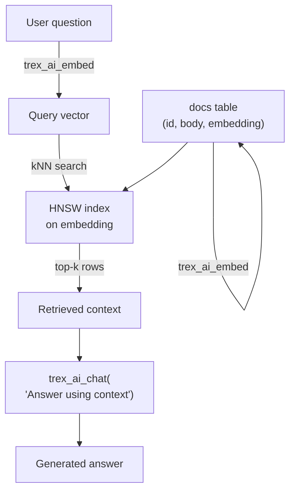

# LLM-Augmented SQL

This tutorial uses the `ai` extension to put LLM inference directly inside
SQL: vector search, in-query summarisation, classification, and a small RAG
pipeline — all with no network hop to an external model API. The point:
when inference is a SQL function, you compose it with `JOIN`, `GROUP BY`,
window functions, and pgwire transactions like any other expression.

By the end you'll have:

- An embedding model and a chat model loaded in-process.
- A vector-indexed table of documents.
- Semantic search via SQL.
- A `SELECT` that pulls retrieved context into a chat completion (RAG, in
  one query).
- Bulk classification via batch inference.



Prerequisites: [Quickstart: Deploy](../quickstarts/deploy) running, plus
~10 GB free disk and 8 GB free RAM (more if you go for a 13B model).

:::note amd64 only
The `ai` extension is amd64-only. ARM hosts won't have `trex_ai_*`
functions registered — verify with `SELECT trex_ai_status();` before
starting.
:::

## 1. Get models on disk (5 min)

The `ai` extension ships an HF downloader. It takes a **full URL** (the
HuggingFace `org/repo` shorthand is not accepted) and writes the file to
a directory **relative to the server cwd** (`/usr/src` in the container).
The directory must already exist and be writable by the `node` user — on
the host, run `mkdir -p models && chown 1000:1000 models` (or pick any
writable location under the cwd) before invoking the downloader:

```sql
-- Embedding model: ~270 MB, runs on CPU happily
SELECT trex_ai_download_model(
  'https://huggingface.co/nomic-ai/nomic-embed-text-v1.5-GGUF/resolve/main/nomic-embed-text-v1.5.Q4_K_M.gguf',
  'nomic-embed-text-v1.5.Q4_K_M.gguf',
  'models'
);

-- Chat model: ~4 GB, faster on GPU but CPU works
SELECT trex_ai_download_model(
  'https://huggingface.co/TheBloke/Llama-2-7B-Chat-GGUF/resolve/main/llama-2-7b-chat.Q4_K_M.gguf',
  'llama-2-7b-chat.Q4_K_M.gguf',
  'models'
);

-- Verify (path resolves to /usr/src/models inside the container)
SELECT trex_ai_list_models('models');
```

## 2. Load both, under separate aliases (1 min)

The load functions take `(path, alias)` — path first, alias second.

:::caution Known engine quirk
The `alias` argument is currently **ignored**. The model is registered
under the GGUF filename stem (e.g. `nomic-embed-text-v1.5.Q4_K_M`), and
that's the name you must use in every subsequent `trex_ai_*` call. The
alias parameter is preserved for forward compatibility.
:::

```sql
SELECT trex_ai_load_model_for_embeddings(
  '/usr/src/models/nomic-embed-text-v1.5.Q4_K_M.gguf',
  'embed'   -- alias currently ignored; model registers under filename stem
);
SELECT trex_ai_load_model(
  '/usr/src/models/llama-2-7b-chat.Q4_K_M.gguf',
  'chat'    -- alias currently ignored; model registers under filename stem
);

-- Confirm both are loaded — note the names are the filename stems,
-- not the aliases passed above.
SELECT trex_ai_list_loaded();
SELECT trex_ai_gpu_info();   -- CUDA / Vulkan / Metal / CPU
```

A model loaded for embeddings can't also do generation — that's why
they're separate.

## 3. Build a corpus (5 min)

Pretend you're indexing internal product docs. Create a table:

```sql
CREATE TABLE memory.main.docs (
  id        INTEGER PRIMARY KEY,
  title     TEXT,
  body      TEXT,
  embedding FLOAT[768]    -- nomic-embed v1.5 produces 768-d vectors
                          -- (MiniLM-L6 would be 384-d; match the model)
);

INSERT INTO memory.main.docs (id, title, body) VALUES
  (1, 'Pricing',    'We charge per active user per month. Volume discounts kick in at 1000 seats.'),
  (2, 'Refunds',    'Refunds are processed within 5 business days. Annual plans are pro-rated.'),
  (3, 'SSO',        'SAML 2.0 and OIDC are supported on the Enterprise tier.'),
  (4, 'Auth',       'Password sign-in, OAuth (Google, GitHub, Microsoft), magic links, and OIDC.'),
  (5, 'API limits', 'Free tier: 100 req/min. Pro: 1000 req/min. Enterprise: negotiable.'),
  (6, 'Data retention', 'Logs retained 30 days. Customer data retained for the duration of the contract.'),
  (7, 'Backup',     'Daily Postgres backups with 7-day point-in-time recovery on the Pro tier.'),
  (8, 'Encryption', 'TLS in transit, AES-256 at rest. Customer-managed keys on Enterprise.');
```

Compute and store embeddings:

```sql
UPDATE memory.main.docs
SET embedding = (trex_ai_embed('nomic-embed-text-v1.5.Q4_K_M', body)::JSON
                   ->> 'embeddings')::FLOAT[]
WHERE embedding IS NULL;

-- Verify
SELECT id, title, array_length(embedding, 1) AS dim
  FROM memory.main.docs LIMIT 3;
```

(Behind the scenes `trex_ai_embed` returns a JSON object of the form
`{"embeddings":[...]}`. Extract the array with `->> 'embeddings'` and
cast to `FLOAT[]` to put it in a column. For very large corpora,
[batch processing](#7-bulk-classification-5-min) is faster.)

Add an HNSW index for fast similarity search:

```sql
INSTALL vss; LOAD vss;
CREATE INDEX docs_embed_idx
  ON memory.main.docs
  USING HNSW (embedding)
  WITH (metric = 'cosine');
```

## 4. Semantic search (3 min)

A semantic search is just a kNN query against the index:

```sql
WITH q AS (
  SELECT (trex_ai_embed('nomic-embed-text-v1.5.Q4_K_M',
                        'how do I get a refund?')::JSON
            ->> 'embeddings')::FLOAT[] AS vec
)
SELECT d.id, d.title, d.body,
       array_cosine_distance(d.embedding, q.vec) AS distance
  FROM memory.main.docs d, q
 ORDER BY distance
 LIMIT 3;
```

Output:

```
 id |   title    |                       body                        | distance
----+------------+---------------------------------------------------+----------
  2 | Refunds    | Refunds are processed within 5 business days...   | 0.18
  1 | Pricing    | We charge per active user per month...            | 0.41
  6 | Data retention | Logs retained 30 days...                      | 0.47
```

The interesting bit isn't that it works — every vector DB does this. The
interesting bit is that it's a single SQL query. You can join the result
to other tables, filter by metadata, paginate, and feed it to downstream
operators (including the chat model — see next step) without leaving the
engine.

## 5. RAG in one query (5 min)

Retrieve top-k context, format a prompt, hand it to the chat model — all in
one statement:

```sql
WITH q AS (
  SELECT 'how do I get a refund?' AS question,
         (trex_ai_embed('nomic-embed-text-v1.5.Q4_K_M',
                        'how do I get a refund?')::JSON
            ->> 'embeddings')::FLOAT[] AS vec
),
ctx AS (
  SELECT d.id, d.title, d.body
    FROM memory.main.docs d, q
   ORDER BY array_cosine_distance(d.embedding, q.vec)
   LIMIT 3
),
prompt AS (
  SELECT q.question,
         '[' || string_agg(
           '{"role":"system","content":' || to_json('Doc: ' || ctx.title || E'\n' || ctx.body)::TEXT || '}',
           ','
         ) || ',{"role":"user","content":' || to_json(q.question)::TEXT || ']' AS messages
    FROM q, ctx
   GROUP BY q.question
)
SELECT trex_ai_chat(
  'llama-2-7b-chat.Q4_K_M',
  prompt.messages,
  '{"temperature": 0.2, "max_tokens": 200}'
) AS answer
FROM prompt;
```

Output:

```
 answer
---------
 Refunds are processed within 5 business days. If you're on an annual plan, the refund is pro-rated based on the unused portion of your subscription.
```

The retrieval, prompt assembly, and inference are one round-trip — the
client sees a single result row.

## 6. In-query summarisation (3 min)

For row-level operations, the AI functions are scalar. Summarise long
documents in a `SELECT`:

```sql
ALTER TABLE memory.main.docs ADD COLUMN summary TEXT;

UPDATE memory.main.docs
SET summary = trex_ai_chat(
  'llama-2-7b-chat.Q4_K_M',
  json_array(
    json_object('role', 'system', 'content',
      'Summarise the following document in one sentence.'),
    json_object('role', 'user', 'content', body)
  )::TEXT,
  '{"temperature": 0.1, "max_tokens": 60}'
)
WHERE summary IS NULL;

SELECT id, title, summary FROM memory.main.docs ORDER BY id;
```

This is sequential — each call runs through one inference context. For
large updates, batch processing is dramatically faster.

## 7. Bulk classification (5 min)

The batch API submits many prompts and runs them through the inference
context pool concurrently. Useful when you want to label a large
table:

```sql
-- Classify each doc as one of: pricing, security, feature, ops
WITH batch AS (
  SELECT trex_ai_batch_process(
    '{
      "model": "llama-2-7b-chat.Q4_K_M",
      "options": {"temperature": 0.0, "max_tokens": 4},
      "prompts": [' ||
      string_agg(
        '{"id":' || id || ',"prompt":"Classify this product doc as one of: pricing, security, feature, ops. Reply with only the single word.\n\n' || replace(body, '"', '\"') || '"}',
        ','
      ) ||
      ']
    }'
  ) AS batch_id
  FROM memory.main.docs
)
SELECT batch_id FROM batch;
```

Poll for results:

```sql
SELECT trex_ai_batch_result('batch-...');
```

When done, parse the JSON result and update the table:

```sql
ALTER TABLE memory.main.docs ADD COLUMN category TEXT;

WITH r AS (
  SELECT * FROM (
    SELECT trex_ai_batch_result('batch-...') AS j
  ) t,
  LATERAL json_each(j::JSON) AS kv
)
UPDATE memory.main.docs
SET category = TRIM(kv.value::TEXT, '"')
FROM r kv
WHERE docs.id::TEXT = kv.key;

SELECT id, title, category FROM memory.main.docs ORDER BY category, id;
```

For 8 docs the batch is overkill — for 800k it cuts wall time by 10-50x
depending on context-pool size and GPU.

## 8. Operational notes

- **Memory accounting.** The chat model lives outside the engine's
  catalog allocator. Plan pod / VM RSS for *engine + AI model + AI
  inference contexts*. A 7B Q4 model is ~5 GB resident.
- **Latency vs. throughput.** Single calls are fast on warm contexts
  (~50-200ms for a short generation); the cost is *cold start*
  (`trex_ai_load_model` can take 10-30s for a 7B). Load once at boot
  via a SQL-init script and keep models hot.
- **Determinism.** Set `"temperature": 0.0` and `"seed": 42` for
  reproducible outputs — useful in tests, harmful in summaries.
- **Pgwire pinning.** Heavy AI calls auto-pin the underlying engine
  connection (see [Concepts → Connection Pool](../concepts/connection-pool#sessions-and-pinning)).
  At high concurrency this can saturate the pool — observe
  `trex_ai_context_pool_status()` and `trex_db_query_status()` together.
- **Embedding drift.** If you upgrade the embedding model, you need to
  re-embed and re-index. The HNSW index is tied to the embedding space.
- **Quantization quality.** Some GGUF quantizations of certain embedding
  models produce all-zero or NaN vectors from `trex_ai_embed`. Spot-check
  with `array_length` and a sanity-distance query before bulk-embedding.
  In this image, **nomic-embed v1.5 Q4** is the known-good option; if
  you swap models, validate first.

## What you built

LLM inference as first-class SQL:

- Vector search composed with regular `SELECT`s and joins.
- Retrieval-augmented generation in one query.
- Per-row summarisation as a column transform.
- Bulk classification scaled by the inference pool.

No external API keys. No network hops. No separate model service. The
model and the data live in the same process.

## Next steps

- [Tutorial: Agentic Trex with MCP](agentic-trex-with-mcp) — flip the
  agent direction: instead of you driving an LLM through SQL, an LLM
  drives Trex through MCP.
- [SQL Reference → ai](../sql-reference/ai) for the full function
  surface (chat templates, sampling options, batch shape).
- [Concepts → Connection Pool](../concepts/connection-pool) for what
  happens when an inference call holds a context for seconds and other
  queries arrive.
