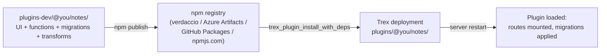

# Publish a Plugin

This tutorial extends [Tutorial: Build a Plugin](build-a-plugin)
into a real, redistributable plugin: a complete package combining UI,
function, migration, and transform pieces; published to an npm registry;
installed on a fresh Trex deployment via `tpm`; and maintained through
versioned releases.

By the end you'll have:

- A scaffolded multi-type plugin with UI + functions + migrations + a
  transform model.
- A scope-based authorization model so non-admins can use it safely.
- A published npm package on a private (or public) registry.
- A repeatable install path on any Trex deployment.
- A versioning + deprecation strategy.



Prerequisites: [Tutorial: Build a Plugin](build-a-plugin)
completed (you've made one tiny plugin work). An npm registry you can
publish to — for development, a local
[Verdaccio](https://verdaccio.org/) instance is fine.

## 1. Scaffold the plugin (5 min)

```bash
mkdir -p plugins-dev/@you/notes/{functions,dist,migrations,project/models,src}
cd plugins-dev/@you/notes
```

`deno.json` — required so the plugin is its own Deno workspace root.
Without it, the EdgeRuntime function worker fails to bootstrap with
`Config file must be a member of the workspace`:

```bash
cat > deno.json <<'EOF'
{
  "nodeModulesDir": "manual",
  "unstable": ["sloppy-imports"]
}
EOF
```

`package.json`:

```json
{
  "name": "@you/notes",
  "version": "0.1.0",
  "description": "Trex plugin: notes with categorisation",
  "license": "MIT",
  "files": ["functions", "dist", "migrations", "project", "deno.json", "package.json"],
  "scripts": {
    "build": "vite build",
    "dev": "vite"
  },
  "trex": {
    "migrations": {
      "schema": "notes",
      "database": "_config"
    },
    "functions": {
      "env": {
        "_shared": {
          "DATABASE_URL": "${DATABASE_URL}"
        }
      },
      "roles": {
        "notes-author":   ["notes:read", "notes:write"],
        "notes-reader":   ["notes:read"]
      },
      "scopes": [
        { "path": "/plugins/you/notes/admin/*", "scopes": ["notes:write"] },
        { "path": "/plugins/you/notes/*",       "scopes": ["notes:read"] }
      ],
      "api": [{
        "source": "/notes",
        "function": "/functions",
        "imports": "/functions/import_map.json"
      }]
    },
    "ui": {
      "routes": [
        { "path": "/notes", "dir": "dist", "spa": true }
      ],
      "uiplugins": {
        "sidebar": [{
          "route": "/plugins/you/notes",
          "label": "Notes",
          "icon": "StickyNote"
        }]
      }
    },
    "transform": {}
  },
  "devDependencies": {
    "vite": "^5",
    "react": "^18",
    "react-dom": "^18",
    "@vitejs/plugin-react": "^4"
  }
}
```

The `files` field controls what npm publishes — keep build artifacts
(`dist/`) in there, exclude source + node_modules (npm does the latter
automatically).

## 2. Migration (3 min)

`migrations/V1__create_notes.sql`:

```sql
CREATE TABLE IF NOT EXISTS notes.note (
  id         UUID PRIMARY KEY DEFAULT gen_random_uuid(),
  user_id    UUID NOT NULL,
  title      TEXT NOT NULL,
  body       TEXT NOT NULL DEFAULT '',
  category   TEXT,
  created_at TIMESTAMPTZ NOT NULL DEFAULT NOW(),
  updated_at TIMESTAMPTZ NOT NULL DEFAULT NOW()
);

CREATE INDEX IF NOT EXISTS note_user_idx
  ON notes.note(user_id, created_at DESC);

CREATE INDEX IF NOT EXISTS note_category_idx
  ON notes.note(category) WHERE category IS NOT NULL;
```

The plugin migration runner ([Plugins → Migration Plugins](../plugins/migration-plugins))
auto-creates the `notes` schema and tracks applied versions in
`notes._migrations`.

## 3. Function (5 min)

`functions/index.ts`:

```typescript
import { Pool } from "https://deno.land/x/postgres@v0.17.0/mod.ts";

const DATABASE_URL = Deno.env.get("DATABASE_URL")!;
const pool = new Pool(DATABASE_URL, 5, true);

Deno.serve(async (req: Request) => {
  const url = new URL(req.url);
  const userId = req.headers.get("x-user-id");
  if (!userId) {
    return new Response("Unauthenticated", { status: 401 });
  }

  // Routes:
  //   GET  /plugins/you/notes/list             — list current user's notes
  //   POST /plugins/you/notes/create           — create a note
  //   POST /plugins/you/notes/admin/categorise — admin: assign categories
  const path = url.pathname.replace(/^\/plugins\/you\/notes/, "");

  const conn = await pool.connect();
  try {
    if (req.method === "GET" && path === "/list") {
      const r = await conn.queryObject`
        SELECT id, title, body, category, created_at
          FROM notes.note WHERE user_id = ${userId}
         ORDER BY created_at DESC LIMIT 50`;
      return Response.json(r.rows);
    }

    if (req.method === "POST" && path === "/create") {
      const { title, body } = await req.json();
      const r = await conn.queryObject`
        INSERT INTO notes.note (user_id, title, body)
        VALUES (${userId}, ${title}, ${body ?? ""})
        RETURNING id, title, body, created_at`;
      return Response.json(r.rows[0], { status: 201 });
    }

    if (req.method === "POST" && path === "/admin/categorise") {
      // The scope rule above gates this on notes:write
      const { rules } = await req.json();
      let updated = 0;
      for (const { match, category } of rules) {
        const r = await conn.queryObject`
          UPDATE notes.note SET category = ${category}, updated_at = NOW()
           WHERE body ILIKE ${`%${match}%`} AND category IS NULL`;
        updated += r.rowCount ?? 0;
      }
      return Response.json({ updated });
    }

    return new Response("Not found", { status: 404 });
  } finally {
    conn.release();
  }
});
```

`functions/import_map.json`:

```json
{
  "imports": {
    "postgres": "https://deno.land/x/postgres@v0.17.0/mod.ts"
  }
}
```

## 4. UI (10 min)

A minimal React + Vite SPA that calls the function endpoints.

`src/main.tsx`:

```tsx
import React, { useEffect, useState } from "react";
import { createRoot } from "react-dom/client";

const BASE = "/plugins/you/notes";
function token() { return localStorage.getItem("trex_token") ?? ""; }
async function api(path: string, init?: RequestInit) {
  const res = await fetch(`${BASE}${path}`, {
    ...init,
    headers: {
      ...(init?.headers ?? {}),
      "Authorization": `Bearer ${token()}`,
      "Content-Type": "application/json",
    },
  });
  if (!res.ok) throw new Error(await res.text());
  return res.json();
}

function App() {
  const [notes, setNotes] = useState<any[]>([]);
  const [draft, setDraft] = useState({ title: "", body: "" });

  async function load() { setNotes(await api("/list")); }
  useEffect(() => { load(); }, []);

  async function create(e: React.FormEvent) {
    e.preventDefault();
    await api("/create", { method: "POST", body: JSON.stringify(draft) });
    setDraft({ title: "", body: "" });
    load();
  }

  return (
    <div style={{ maxWidth: 720, margin: "2rem auto", fontFamily: "system-ui" }}>
      <h1>Notes</h1>
      <form onSubmit={create} style={{ display: "grid", gap: 8, marginBottom: 24 }}>
        <input
          placeholder="Title"
          value={draft.title}
          onChange={e => setDraft({ ...draft, title: e.target.value })}
        />
        <textarea
          placeholder="Body"
          rows={4}
          value={draft.body}
          onChange={e => setDraft({ ...draft, body: e.target.value })}
        />
        <button type="submit">Add</button>
      </form>
      <ul>
        {notes.map(n => (
          <li key={n.id}>
            <strong>{n.title}</strong>
            {n.category && <em> · {n.category}</em>}
            <p>{n.body}</p>
          </li>
        ))}
      </ul>
    </div>
  );
}

createRoot(document.getElementById("root")!).render(<App />);
```

`index.html`:

```html
<!doctype html>
<html><head><title>Notes</title></head>
<body><div id="root"></div><script type="module" src="/src/main.tsx"></script></body>
</html>
```

`vite.config.ts`:

```typescript
import { defineConfig } from "vite";
import react from "@vitejs/plugin-react";

export default defineConfig({
  base: "/plugins/you/notes/",
  plugins: [react()],
  build: { outDir: "dist" },
});
```

Build:

```bash
npm install
npm run build
```

`dist/` is what the plugin's `ui.routes[0].dir` references.

## 5. Transform model (5 min)

For aggregate views — say "notes per category, last 30 days":

`project/models/notes_by_category.sql`:

```sql
SELECT
  category,
  COUNT(*)               AS notes,
  COUNT(DISTINCT user_id) AS users
FROM _config.notes.note
WHERE created_at >= NOW() - INTERVAL '30 days'
  AND category IS NOT NULL
GROUP BY category
ORDER BY notes DESC
```

The transform engine does **not** process Jinja templates like
`{{ source(...) }}` or `{{ config(...) }}`; use a raw cross-database
reference (`<database>.<schema>.<table>`) instead. Since the migration
in §2 writes into the metadata Postgres (`database: _config`,
`schema: notes`), the model reads from `_config.notes.note`. This
matches the pattern used by bundled plugins like `@trex/sales-mart`.

Configuration goes in a sibling YAML file — SQL comments at the top of
the model are ignored:

```yaml
# project/models/notes_by_category.yml
materialized: view
endpoint_path: /by-category
```

The transform engine also requires a project-level manifest declaring
the local source-table list (empty if every source is cross-DB):

```yaml
# project/project.yml
source_tables: []
```

Once deployed, this is reachable at
`GET /plugins/transform/notes/by-category?format=json`.

## 6. Local install + test (3 min)

While developing, the plugin lives in `plugins-dev/`. Restart Trex so the
loader picks it up:

```bash
docker compose restart trex
```

Watch the logs:

```
Found plugin notes (v0.1.0) [dev] in /usr/src/plugins-dev/@you/notes
Registered migration plugin notes (schema: notes, database: _config)
add fn /notes @ /usr/src/plugins-dev/@you/notes/functions/index.ts
Registering static route: /plugins/you/notes -> /usr/src/plugins-dev/@you/notes/dist
Registered SPA fallback: /plugins/you/notes/* -> /usr/src/plugins-dev/@you/notes/dist/index.html
Registered transform plugin notes
Plugin notes: migrations up to date
Registered plugin notes [dev]
```

Run the transform once so the endpoint is registered:

```bash
TOKEN=trex_...
curl -X POST http://localhost:8001/trex/graphql \
  -H "Authorization: Bearer $TOKEN" \
  -H "Content-Type: application/json" \
  -d '{"query":"mutation { transformRun(pluginName: \"notes\", destDb: \"memory\", destSchema: \"notes_marts\", sourceDb: \"_config\", sourceSchema: \"notes\") { name action } }"}'
```

Test the function:

```bash
USER_TOKEN=...   # a regular user's access_token
curl -X POST http://localhost:8001/plugins/you/notes/create \
  -H "Authorization: Bearer $USER_TOKEN" \
  -H "Content-Type: application/json" \
  -d '{"title":"Hello","body":"My first note"}'

curl http://localhost:8001/plugins/you/notes/list \
  -H "Authorization: Bearer $USER_TOKEN"
```

If `curl /plugins/you/notes/list` returns
`worker boot error: failed to bootstrap runtime: Config file must be a
member of the workspace`, double-check that `deno.json` from §1 is
present. (There's a known regression in the current image that affects
function workers — check the project's open issues if it persists with
`deno.json` in place.)

Open the UI in a browser at `http://localhost:8001/plugins/you/notes/`.

## 7. Set up a registry (5 min)

For a publishable workflow, you need somewhere to push. Options:

- **Verdaccio** (local / dev): `npx verdaccio` → runs on `:4873`.
- **Azure Artifacts** / **GitHub Packages** / **AWS CodeArtifact** /
  **Nexus** / **Cloudsmith** for production private registries.
- **npmjs.com** if the plugin is open source.

For this tutorial, use Verdaccio:

```bash
docker run -d --name verdaccio -p 4873:4873 verdaccio/verdaccio

# Add the registry to your local npm config
npm set registry http://localhost:4873
npm adduser --registry http://localhost:4873   # creates a local user
```

Configure Trex to install from it:

```yaml
# docker-compose.yml: trex.environment
TPM_REGISTRY_URL: "http://verdaccio:4873"
PLUGINS_INFORMATION_URL: "http://verdaccio:4873/-/all"
```

(`PLUGINS_INFORMATION_URL` is the package-feed listing for the admin UI's
plugin browser. Verdaccio exposes it at `/-/all`.)

## 8. Publish (2 min)

From `plugins-dev/@you/notes/`:

```bash
npm run build               # rebuild dist/
npm publish --registry http://localhost:4873
```

You'll see:

```
+ @you/notes@0.1.0
```

Verify it's there:

```bash
curl http://localhost:4873/@you%2Fnotes
```

## 9. Install on a fresh Trex (3 min)

This is the deployment flow — what you'd do on a different host.

From a Trex `psql` session pointed at a fresh deployment:

```sql
-- See what's available
SELECT * FROM trex_plugin_info('@you/notes');

-- Install it (with deps, if any)
SELECT * FROM trex_plugin_install_with_deps(
  '@you/notes@0.1.0',
  '/usr/src/plugins'
);

-- Confirm
SELECT * FROM trex_plugin_list('/usr/src/plugins');
```

Restart Trex. The plugin loads, the migration runs, the routes mount,
the transform model registers — same lifecycle as the dev install.

The MCP tool `plugin-install` and the GraphQL `installPlugin` mutation
wrap the same SQL. Both work for agents and admin UIs.

## 10. Versioning + releases (5 min)

Treat the plugin like any other npm package:

- Use semver: bump patch (`0.1.1`) for bug fixes, minor (`0.2.0`) for
  features, major (`1.0.0`) for breaking changes.
- Tag releases in git.
- For migrations, **never edit applied migrations** — add a new
  `V2__…sql` file. Existing deployments will pick it up on the next
  install + restart.
- For function / UI changes, the new version replaces the old on
  install — there is no in-place hot upgrade. Restart is required.

A standard release flow:

```bash
# Edit, build, test locally
npm version patch     # bumps version, creates git tag
git push --tags

# Publish
npm run build
npm publish

# In production:
psql -h prod-trex -p 5433 -U trex -c \
  "SELECT * FROM trex_plugin_install_with_deps('@you/notes@0.1.1', '/usr/src/plugins')"
# then trigger a rolling restart
```

For a CI flow, automate steps 1-3 on git tags. The
`@semantic-release/git` config the Trex CLI uses is a good template.

## 11. Deprecation + removal

Plugins should announce deprecations before removing functionality:

```json
{
  "name": "@you/notes",
  "version": "0.3.0",
  "deprecated": "Replaced by @you/notes-pro. Migrate via the import script."
}
```

`npm publish` with a `deprecated` field marks the version. Existing installs
keep working; new installs get a warning.

To remove a plugin from a deployment:

```sql
SELECT * FROM trex_plugin_delete('@you/notes', '/usr/src/plugins');
```

…then restart. This removes the directory but does **not** drop the
plugin's database schema (`notes`) — that's a separate, intentional
operation:

```sql
DROP SCHEMA notes CASCADE;
```

## 12. Distribution checklist

Before publishing v1.0:

- [ ] `package.json/files` array is correct — no source maps, no
      `node_modules`, no `.env`.
- [ ] Migrations are idempotent (`CREATE … IF NOT EXISTS`, `DROP … IF
      EXISTS`).
- [ ] Function code reads only env vars declared in `trex.functions.env`.
- [ ] Roles and scopes are namespaced (`notes:read`, not `read`).
- [ ] UI assets are built with the correct `base` URL
      (`/plugins/you/notes/`).
- [ ] Transform models declare freshness thresholds if the plugin is
      latency-sensitive.
- [ ] README with: install command, env vars consumed, scopes contributed,
      tables created, migration history.
- [ ] LICENSE file.
- [ ] CI publishing pipeline (npm publish on git tag).

## What you built

A real, distributable Trex plugin that:

- Combines all five plugin types in one package.
- Authors its own authorization model with scoped roles.
- Carries its own schema migrations, owned by the plugin.
- Exposes a UI, two HTTP routes, and a transform endpoint.
- Publishes to an npm registry and installs cleanly on any Trex
  deployment.
- Has a versioning + deprecation story that scales to many releases.

This is the shape every published plugin should take. The bundled plugins
in the runtime image (`web`, `notebook`, `cli`, `storage`, `pg-meta`) are
all built this way.

## Next steps

- [Concepts → Plugin System](../concepts/plugin-system) for the discovery
  + lifecycle + authorization model in depth.
- [Plugins](../plugins/overview) for per-type configuration references
  (UI, function, flow, migration, transform).
- [SQL Reference → tpm](../sql-reference/tpm) for the install / list /
  delete SQL surface.
- [APIs → MCP](../apis/mcp) — `plugin-install` and `plugin-list` MCP
  tools wrap the same flow for agents.
